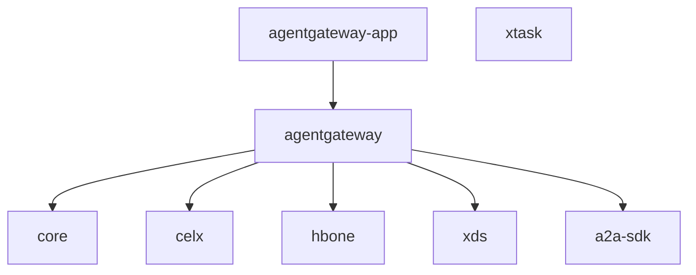

# Agentgateway

Open source data plane for agentic AI connectivity, written in Rust. Provides security, observability, and governance for agent-to-agent and agent-to-tool communication, supporting A2A and MCP protocols.

This is a fork (originally `jakemannix/agentgatewaygastown`, transferred + renamed to `yetanotheruseless/agentgateway` on 2026-05-03) used as a prototype/testbed for virtual tool composition, registry patterns, and research-assistant demo work.

## Crate Architecture

## Workspace Crates

| Crate | Files | Feature | Description | Status |
|-------|-------|---------|-------------|--------|
| agentgateway | 216 | [[features/agentgateway-mcp\|MCP]], [[features/agentgateway-http\|HTTP]], [[features/agentgateway-llm\|LLM]], [[features/agentgateway-proxy\|Proxy]] | Main library: proxy, MCP/A2A, LLM, config | pending |
| core | 20 | [[features/core\|core]] | Shared primitives: telemetry, metrics, tracing | pending |
| a2a-sdk | 2 | [[features/a2a-sdk\|a2a-sdk]] | Agent2Agent protocol types | pending |
| celx | 5 | [[features/celx\|celx]] | CEL expression evaluation wrapper | pending |
| hbone | 4 | [[features/hbone\|hbone]] | HTTP/2 CONNECT tunneling | pending |
| xds | 4 | [[features/xds\|xds]] | XDS protocol for dynamic config | pending |
| agentgateway-app | 1 | [[features/agentgateway-app\|app]] | Binary entry point | pending |
| xtask | 2 | [[features/xtask\|xtask]] | Development tasks (schema gen) | pending |

## Agentgateway Sub-modules (main crate)

| Sub-module | Files | Feature | Status |
|------------|-------|---------|--------|
| mcp/ | 48 | [[features/agentgateway-mcp\|MCP handling]] | pending |
| http/ | 46 | [[features/agentgateway-http\|HTTP layer]] | pending |
| llm/ | 37 | [[features/agentgateway-llm\|LLM passthrough]] | pending |
| types/ | 10 | [[features/agentgateway-types\|Types]] | pending |
| proxy/ | 8 | [[features/agentgateway-proxy\|Proxy core]] | pending |
| client/ | 7 | [[features/agentgateway-client\|Client]] | pending |
| parse/ | 7 | [[features/agentgateway-config\|Config parsing]] | pending |
| transport/ | 6 | [[features/agentgateway-transport\|Transport]] | pending |
| management/ | 5 | [[features/agentgateway-management\|Management API]] | pending |
| stateful/ | 5 | [[features/agentgateway-stateful\|Stateful sessions]] | pending |
| telemetry/ | 4 | [[features/agentgateway-telemetry\|Telemetry]] | pending |
| saga/ | 4 | [[features/agentgateway-orchestration\|Orchestration]] | pending |
| workflow/ | 4 | [[features/agentgateway-orchestration\|Orchestration]] | pending |
| cel/ | 3 | [[features/agentgateway-cel\|CEL context]] | pending |
| store/ | 3 | [[features/agentgateway-store\|Storage]] | pending |
| control/ | 2 | [[features/agentgateway-control\|Control plane]] | pending |
| a2a/ | 2 | [[features/agentgateway-a2a\|A2A handling]] | pending |
| patterns/ | 2 | [[features/agentgateway-mcp\|MCP patterns]] | pending |

## Non-Rust Components

| Component | Path | Description | Status |
|-----------|------|-------------|--------|
| UI | ui/ | React dashboard for exploring connections | pending |
| Examples | examples/ | 17 example configurations and demos | pending |
| Schema | schema/ | JSON Schema for config validation, CEL | pending |
| vmcp-dsl | packages/vmcp-dsl/ | Virtual MCP DSL package | pending |
| registry-dsl | packages/registry-dsl/ | Registry DSL package | pending |

## External Repos

| Repo | Role | Interface |
|------|------|-----------|
| `jakemannix/virtual-tools-spec` | Tool schemas, registry, DSL, OpenAPI gen | [[interfaces/registry-format]] |
| `jakemannix/anyalignment-deploy` | Deployment GitOps | Gateway + MCP server |

## File Registry

List populated as modules are documented.

| Source File | Feature | Component |
|------------|---------|-----------|

## Init Progress

Current phase: **complete**

### Phase 3 Checklist

| Category | Target | Created | Status |
|----------|--------|---------|--------|
| Features | 19 | 19 | done |
| Components | 20-25 | 25 | done |
| Concepts | 6-10 | 6 | done |
| Decisions | 5-8 | 4 | done |
| Interfaces | 4-6 | 3 | done |
| References | ~10 | 6 | done |
| CLAUDE.md | — | — | done |
| Guides | 1-2 | 0 | skipped (see references/imported/development.md) |
