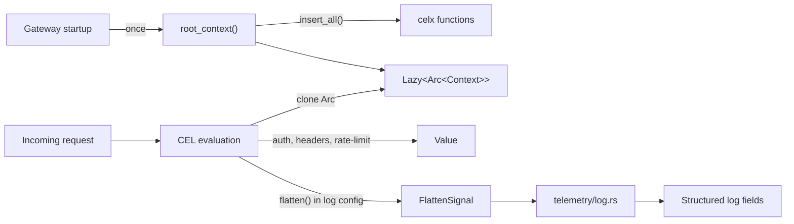

# CEL Integration — How agentgateway Consumes celx

## Purpose

Documents the integration points between the `celx` crate and the main `agentgateway` crate. There are exactly two consumption points.

## Integration Points

### 1. Root Context Initialization (`cel/mod.rs`)

```rust
fn root_context() -> Arc<Context<'static>> {
    let mut ctx = Context::default();
    agent_celx::insert_all(&mut ctx);
    Arc::new(ctx)
}

static ROOT_CONTEXT: Lazy<Arc<Context<'static>>> = Lazy::new(root_context);
```

A single `Lazy<Arc<Context>>` is created at startup with all celx functions registered. This context is cloned (via `Arc`) for every CEL expression evaluation — authorization checks, header transforms, rate limiting key extraction, log field enrichment. The functions are registered once and shared across all threads.

### 2. FlattenSignal Handling (`telemetry/log.rs`)

```rust
match agent_celx::FlattenSignal::from_value(celv) {
    Some(FlattenSignal::List(li)) => { /* expand list items as log fields */ }
    Some(FlattenSignal::ListRecursive(li)) => { /* recursive expand */ }
    Some(FlattenSignal::Map(m)) => { /* expand map entries as log fields */ }
    Some(FlattenSignal::MapRecursive(m)) => { /* recursive expand */ }
    None => { /* normal value, serialize directly */ }
}
```

When a CEL expression in a logging config calls `flatten()` or `flattenRecursive()`, it returns a `FlattenSignal` opaque value instead of a normal value. The telemetry layer pattern-matches on this signal to expand maps/lists into individual structured log fields rather than serializing them as a single nested JSON value.

## Data Flow



## Related

- [[features/celx|celx Feature]] — the crate being consumed
- [[components/celx/helpers|Helpers Module]] — wrapper system that makes this integration clean
