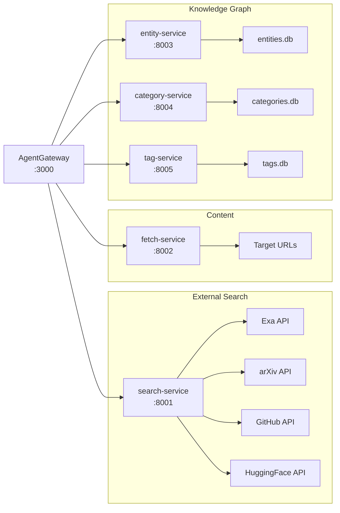

# Backend Services

Five intentionally decoupled MCP microservices that provide the raw tools composed by the gateway's [[concepts/virtual-tool-composition|Virtual Tool Composition]] layer. Each runs as a standalone Python process using FastMCP and communicates with the gateway over Streamable HTTP.

## Service Overview



## search-service (port 8001)

External API integrations. Each tool returns its **native API format** -- normalization is handled declaratively in the [[components/research-assistant-demo/registry-config|registry]].

| Tool | External API | API Key | Returns |
|------|-------------|---------|---------|
| `exa_search` | api.exa.ai | `EXA_API_KEY` (required) | `{query, results: [{title, url, text, highlight, score}]}` |
| `arxiv_search` | export.arxiv.org | None (free) | `{query, papers: [{title, abstract, pdf_url, abs_url, authors}]}` |
| `github_search` | api.github.com | `GITHUB_TOKEN` (optional) | `{query, repos: [{full_name, html_url, description, stars}]}` |
| `huggingface_search` | huggingface.co/api | `HF_TOKEN` (optional) | `{query, models: [{id, url, description, pipeline_tag, downloads}]}` |

Key design: each tool has native response dataclasses (e.g., `ExaResult`, `ExaSearchResponse`). Gateway `outputTransform` mappings in the registry normalize these heterogeneous formats into the common `NormalizedSearchResult` schema without modifying backend code.

When an API key is missing, the tool returns an error in the response body (not an exception): `{"query": "...", "error": "EXA_API_KEY not set", "results": []}`.

## fetch-service (port 8002)

Content retrieval and URL extraction using httpx and BeautifulSoup.

| Tool | Function | Key Parameters |
|------|----------|---------------|
| `url_fetch` | Fetch URL, extract text + metadata | `url`, `extract_text`, `max_length` (100-100000), `include_metadata` |
| `extract_urls` | Regex-based URL extraction from text | `text`, domain filtering |
| `batch_fetch` | Parallel fetch of multiple URLs | `urls[]`, `max_length_per_url` |

Returns `{url, success, content, metadata}` for single fetches. Follows redirects. Has User-Agent header for polite crawling.

## entity-service (port 8003)

Knowledge graph with vector search via **sqlite-vec**. Stores entities (concepts, papers, people, tools) and subject-predicate-object relations.

| Tool | Function | Notes |
|------|----------|-------|
| `entity_search` | Semantic search over descriptions | Uses vector embeddings, optional `entity_type` filter |
| `get_entity` | Retrieve by ID | Optionally includes relations |
| `create_entity` | Add entity | Returns `{success, entity: {id, name, ...}}` |
| `update_entity` | Update fields | |
| `delete_entity` | Remove entity | |
| `search_relations` | Find entity connections | |
| `create_relation` | Link entities | Subject-predicate-object triple |
| `delete_relation` | Remove link | |

Response format: `{"success": true, "entity": {...}}` with `id` nested under `entity` key.

## category-service (port 8004)

Hierarchical taxonomy with materialized paths and vector search.

| Tool | Function | Notes |
|------|----------|-------|
| `search_categories` | Semantic category matching | Vector search over names/descriptions |
| `get_category` | Retrieve by ID | Includes ancestor chain |
| `create_category` | Add category | Optional `parent_id` for hierarchy |
| `update_category` | Modify category | |
| `delete_category` | Remove category | |
| `get_category_tree` | Navigate hierarchy | |
| `list_root_categories` | Top-level categories | |

## tag-service (port 8005)

Content-category association with semantic search over summaries.

| Tool | Function | Notes |
|------|----------|-------|
| `register_content` | Register URL for tagging | Embeds summary for search; returns `{success, content: {id, ...}}` |
| `get_content` | Lookup by ID or URL | |
| `tag_content` | Associate content with category | `content_id` + `category_id` |
| `untag_content` | Remove association | |
| `search_tagged_content` | Find by category | |
| `search_content` | Semantic search over summaries | |
| `bulk_tag` | Tag multiple items | |

## Shared Utilities

Located in `mcp_tools/shared/`:

- **db_utils.py** -- SQLite connection management, migration helpers
- **embeddings.py** -- Vector embedding generation for sqlite-vec (used by entity, category, and tag services)
- **http_runner.py** -- Common MCP server runner with port configuration

## Starting Services

```bash
# All services via start_services.sh (uses tmux)
cd examples/research-assistant-demo
./start_services.sh

# Individual service
uv run python -m mcp_tools.search_service --port 8001
```

## Parent

- [[features/research-assistant-demo|Research Assistant Demo]]

## Related

- [[components/research-assistant-demo/registry-config|Registry Config]] -- how these tools get composed
- [[features/agentgateway-mcp|MCP handling]] -- gateway session management
