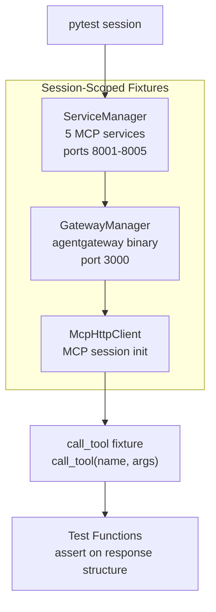

# Test Infrastructure

Integration tests that verify gateway [[concepts/virtual-tool-composition|virtual tool compositions]] without requiring an LLM. Tests exercise the full stack: backend services, gateway, MCP protocol, and composition logic.

## Architecture



## Fixture Stack (conftest.py)

All fixtures are **session-scoped** -- services and gateway start once, shared across all tests. Total startup ~5s, full suite ~25s.

### ServiceManager

Starts 5 backend Python processes as subprocesses:

| Service | Port | Module |
|---------|------|--------|
| search-service | 8001 | `mcp_tools.search_service` |
| fetch-service | 8002 | `mcp_tools.fetch_service` |
| entity-service | 8003 | `mcp_tools.entity_service` |
| category-service | 8004 | `mcp_tools.category_service` |
| tag-service | 8005 | `mcp_tools.tag_service` |

Uses `wait_for_port()` to poll each port until ready (30s timeout, 0.5s interval). On failure, captures stderr for diagnostics.

### GatewayManager

Starts the Rust `agentgateway` binary (debug build at `target/debug/agentgateway`). Loads `config.yaml` with full registry. Sets `RUST_LOG=warn` to reduce noise. Skips if binary not found (with helpful message to run `cargo build`).

### McpHttpClient

Synchronous MCP client using httpx (60s timeout). Implements the MCP session handshake:

1. **Initialize** -- POST to `/mcp` with no session header; extracts `mcp-session-id` from response header
2. **Tool calls** -- POST with session header, returns parsed result

Response parsing handles SSE format (`data:` lines with JSON-RPC). Distinguishes:
- **Protocol errors** (`"error"` in response) -- raises `Exception`
- **Tool errors** (`isError: true` in result) -- raises `McpToolError`
- **Success** -- returns `structuredContent` if present, else parses first text content as JSON

### call_tool Fixture

Function-scoped wrapper: `call_tool(name, args) -> dict`. Tests use this directly:

```python
def test_example(call_tool):
    result = call_tool("virtual_normalized_github", {"query": "test"})
    assert "results" in result
```

## Test Files

### test_arraymap_transforms.py (7 tests, 1 skip)

Verifies `arrayMap` outputTransform produces the common `NormalizedSearchResult` schema.

| Test | What it checks |
|------|---------------|
| `test_normalized_github_schema` | GitHub repos normalized: source=github, source_type=repo, URL starts with github.com |
| `test_normalized_huggingface_schema` | HF models normalized: source=huggingface, source_type=model, URL contains huggingface.co |
| `test_normalized_arxiv_schema` | arXiv papers normalized: source=arxiv, source_type=paper, URL contains arxiv.org |
| `test_web_research_schema` | **SKIP** (needs Exa key). Exa web results: source=exa, source_type=web |
| `test_arraymap_preserves_array_order` | Result array maintains element order |
| `test_arraymap_handles_empty_source_array` | Empty query returns `{results: []}`, not error |
| `test_arraymap_coalesce_fallback` | Coalesce tries secondary path when primary is null |

### test_scatter_gather.py (10 tests, 1 skip)

Tests parallel execution and result aggregation.

| Test | Pattern |
|------|---------|
| `test_code_search_combines_sources` | GitHub + HF both present in results |
| `test_academic_search_combines_sources` | arXiv + HF both present |
| `test_multi_source_search_all_four` | **SKIP** (needs Exa). All 4 sources present |
| `test_scatter_gather_results_flattened` | No nested arrays in output |
| `test_scatter_gather_dedupe_by_url` | No duplicate URLs |
| `test_explore_entity_network_merge` | get_entity + search_relations merged |
| `test_get_knowledge_for_topic_merge` | 3-way merge: entities + categories + content |
| `test_scatter_gather_partial_failure` | Results returned even when one source fails |
| `test_scatter_gather_timeout_handling` | Completes within timeout |
| `test_research_and_fetch_mega_tool` | Full pipeline: scatter-gather + batch_fetch + schemaMap |

The mega-tool test (`test_research_and_fetch_mega_tool`) validates the most complex composition: nested scatter-gather inside a pipeline, verifying all 4 output keys (`relevant_entities`, `relevant_categories`, `search_results`, `fetched_content`).

### test_pipelines.py (7 tests)

Tests sequential step execution and data flow.

| Test | Pattern |
|------|---------|
| `test_fetch_and_extract_pipeline` | url_fetch -> extract_urls produces urls |
| `test_fetch_and_extract_data_flow` | Step 1 output flows to step 2 input |
| `test_pipeline_error_on_first_step` | Invalid URL produces failure indicator |
| `test_store_research_finding_creates_entity` | Forwarding: create_entity returns `{success, entity}` |
| `test_link_entities_creates_relation` | Two-step: create entities, then link them |
| `test_browse_taxonomy_forwards` | Category listing via forwarding tool |
| `test_find_or_create_category_forwards` | Category search via forwarding tool |

### test_aggregation_ops.py (7 tests)

Focused tests on individual aggregation operations.

| Test | Op tested |
|------|-----------|
| `test_extract_pulls_nested_array` | `extract($.results)` |
| `test_flatten_combines_arrays` | `flatten` |
| `test_dedupe_removes_duplicates` | `dedupe($.url)` |
| `test_merge_combines_objects` | `merge` |
| `test_aggregation_handles_empty_results` | Empty results -> empty list |
| `test_aggregation_order_extract_flatten_dedupe` | Full chain in order |
| `test_get_knowledge_merge_multiple_sources` | 3-source merge with test data |

### test_error_handling.py (12 tests)

Edge cases and graceful degradation.

| Test | What it checks |
|------|---------------|
| `test_unknown_tool_returns_error` | Non-existent tool raises exception |
| `test_missing_required_param_returns_error` | Missing `query` raises exception |
| `test_invalid_param_type_returns_error` | Wrong type raises exception |
| `test_scatter_gather_continues_on_partial_failure` | failFast=false works |
| `test_pipeline_first_step_failure_propagates` | Empty URL failure propagation |
| `test_tool_call_with_extra_params_ignored` | Unknown params silently ignored |
| `test_empty_query_returns_empty_or_error` | Graceful empty query |
| `test_very_large_num_results_capped` | Backend enforces max=30 |
| `test_special_characters_in_query` | HTML/regex chars don't crash |
| `test_unicode_in_query` | Unicode handled |
| `test_scatter_gather_all_targets_fail` | All failures -> empty results |
| `test_entity_not_found_error` | Missing entity -> not-found indication |
| `test_create_relation_missing_entities` | Invalid entity IDs -> exception |

## Current Status

**42 passed, 2 skipped** (as of 2026-02-02). The 2 skips require `EXA_API_KEY`.

Previously 17 tests were failing (see `tests/README.md` for historical breakdown by category). These were fixed by updating test assertions and adding `coalesce` defaults to the registry.

## Running

```bash
cd examples/research-assistant-demo

# All tests
uv run pytest tests/ -v

# Single file
uv run pytest tests/test_scatter_gather.py -v

# Single test
uv run pytest tests/test_arraymap_transforms.py::test_normalized_github_schema -v
```

No manual setup needed -- fixtures handle everything.

## Parent

- [[features/research-assistant-demo|Research Assistant Demo]]

## Related

- [[components/research-assistant-demo/registry-config|Registry Config]] -- what's being tested
- [[components/research-assistant-demo/backend-services|Backend Services]] -- services started by fixtures
- [[features/agentgateway-mcp|MCP handling]] -- protocol used by McpHttpClient
