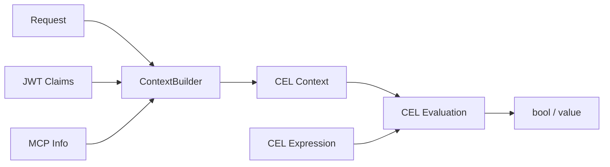

# CEL Policy Evaluation

## What It Is
Common Expression Language (CEL) is used extensively for runtime policy evaluation. Policies are written as CEL expressions that evaluate against a context built from the request, JWT claims, MCP info, and connection metadata.

## Use Cases
- **Authorization**: `jwt.sub == "admin" && mcp.tool.name == "delete_user"`
- **Header modification**: Set/remove headers based on expressions
- **Rate limiting key extraction**: `jwt.org_id` as rate limit partition key
- **Log/trace enrichment**: CEL expressions select which fields to include in structured logs

## Architecture

## Where It Appears
- [[features/celx|celx crate]] — CEL function library (strings, CIDR, JSON, helpers)
- [[features/agentgateway-cel|CEL context]] — builds evaluation context from request data
- [[features/agentgateway-http|HTTP]] — authorization, header modification, rate limiting
- [[features/agentgateway-telemetry|Telemetry]] — `FlattenSignal` for structured log enrichment
- Schema: `schema/cel.json`, `schema/cel-functions.md`
