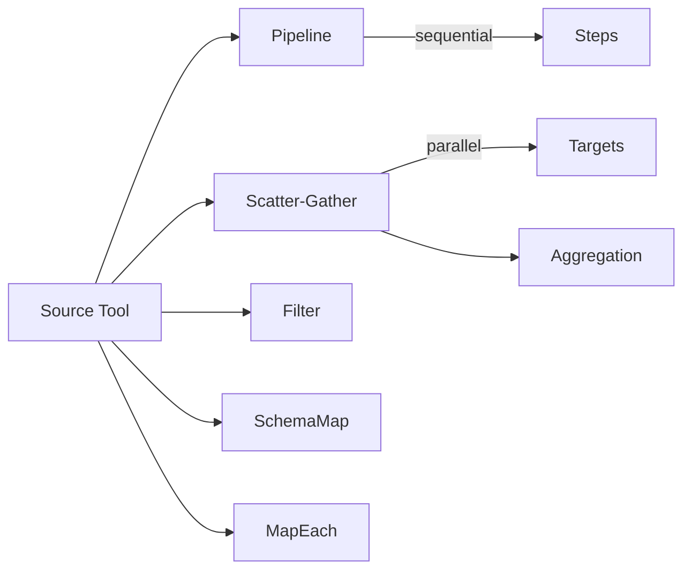

# Virtual Tool Composition

## What It Is
The core innovation in this fork — a declarative algebra for composing MCP tools without writing code. Inspired by Apache Camel's integration patterns, virtual tools let agent authors customize, transform, and orchestrate primitive MCP tools via JSON configuration.

## Three Axes of Customization
1. **Naming** — rename tools and fields to match the agent's domain language
2. **Simplification** — hide input fields, inject defaults, project to needed fields only
3. **Composition** — precompile multi-tool workflows into a single tool call executed by the data plane

## Composition Patterns (Runtime)

| Pattern | Purpose | Status |
|---------|---------|--------|
| Source Tool | 1:1 mapping with transforms | Working |
| Pipeline | Sequential step execution | Working |
| Scatter-Gather | Parallel fan-out + aggregation | Working |
| Filter | Predicate-based result filtering | Working |
| SchemaMap | Field-level output transformation (ArrayMap, Coalesce, Template) | Working |
| MapEach | Per-element array processing | Working |
| Throttle | Rate limiting | Working |
| Timeout | Execution timeout | Working |
| Retry | Automatic retry with backoff | IR only |
| CircuitBreaker | Failure isolation | IR only |
| Cache | Response caching | IR only |
| Saga | Compensating transactions | IR only |

## Where It Appears
- [[features/agentgateway-mcp|MCP handling]] — registry types, compiled IR, executor runtime
- Registry JSON files in `examples/*/gateway-configs/`
- [[references/imported/mcp-algebra|MCP Algebra]] — design vision document
- [[references/imported/virtual-tools|Virtual Tools]] — implementation docs
- [[references/imported/virtual-tools-requirements|Requirements spec]]

## Key Decisions
- [[decisions/tool-algebra-over-string-parsing|Tool algebra over string parsing]] — the current `resource_name()` hack needs replacement
- Virtual tools use `VIRTUAL_SERVER_NAME` constant to route to gateway-internal execution
- Registry supports hot-reload via file watch or HTTP polling
