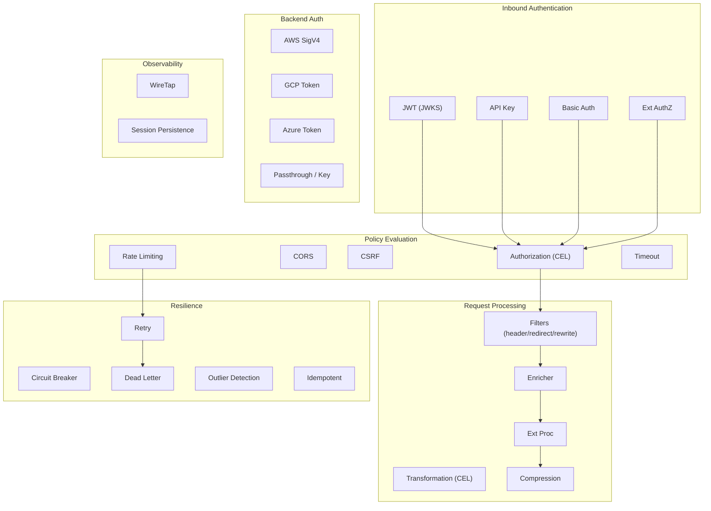

# HTTP Module

The HTTP module (`crates/agentgateway/src/http/`) is the foundational layer for all request/response handling in agentgateway. It provides the core HTTP types, a comprehensive authentication/authorization stack, traffic management policies, and integration patterns that the [[features/agentgateway-proxy|Proxy]] and [[features/agentgateway-mcp|MCP]] layers build upon.

## Architecture

## Core Types

Defined in `mod.rs`:

- **`Request`** / **`Response`** -- type aliases for `http::Request<Body>` / `http::Response<Body>` using `axum_core::body::Body`
- **`HeaderOrPseudo`** -- enum unifying regular HTTP headers with HTTP/2 pseudo-headers (`:method`, `:scheme`, `:authority`, `:path`, `:status`), used throughout for header manipulation
- **`PolicyResponse`** -- carries an optional direct response (short-circuit) plus optional response headers to merge, enabling filters to either modify headers or terminate the request early
- **`RequestOrResponse`** -- mutable enum for shared code that mutates either a request or response
- **`DropBody`** -- wrapper that ties resource lifetime to body consumption

Utility functions: `get_host`, `buffer_limit`, `read_body`, `inspect_body` (peek without consuming), `modify_req_uri`, `classify_content_type` (JSON vs SSE vs unknown).

Rate limit headers are defined in the `x_headers` submodule (`X-RateLimit-Limit`, `X-RateLimit-Remaining`, etc.).

## Components

| Component | Note | Purpose |
|-----------|------|---------|
| Authentication | [[components/agentgateway-http/authentication]] | JWT, API Key, Basic Auth, backend auth (AWS/GCP/Azure) |
| Authorization & Policy | [[components/agentgateway-http/authorization-policy]] | CEL-based authorization rules, CORS, CSRF, rate limiting |
| Traffic Management | [[components/agentgateway-http/traffic-management]] | Retry, circuit breaker, dead letter, outlier detection, session persistence |
| Request Processing | [[components/agentgateway-http/request-processing]] | Filters, CEL transforms, enricher, ext_proc, compression, wiretap |

## Key Design Patterns

1. **CEL everywhere** -- Authorization rules, ext_authz metadata, transformation expressions, rate limit descriptors, and enricher inputs all use CEL expressions compiled at config load time. The `cel::ContextBuilder` registers expressions for lazy evaluation at request time.

2. **Three-mode authentication** -- JWT, API Key, and Basic Auth all support `Strict` (must be present), `Optional` (validate if present), and `Permissive`/default modes. Claims are stripped from the `Authorization` header and inserted into request extensions for downstream access.

3. **PolicyResponse merging** -- Filters return `PolicyResponse` values that either short-circuit (direct response) or accumulate response headers. The proxy merges these across the filter chain.

4. **Envoy-compatible extension points** -- `ext_proc` and `ext_authz` use Envoy's gRPC protobuf contracts (`envoy.service.ext_proc.v3`, `envoy.service.auth.v3`), enabling drop-in compatibility with existing Envoy extension servers.

5. **Enterprise Integration Patterns** -- The module implements several EIPs: WireTap (fire-and-forget side-channel copies), Enricher (parallel data augmentation), Dead Letter (failed request capture), and Idempotent Consumer.

## Related Features

- [[features/agentgateway-proxy|Proxy]] -- consumes HTTP types and policy responses
- [[features/agentgateway-mcp|MCP]] -- MCP session handling builds on session persistence
- [[features/core|Core]] -- telemetry, metrics, tracing infrastructure
