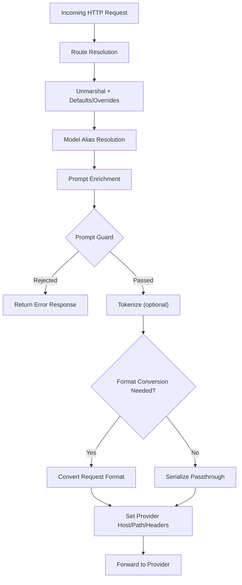

# LLM Request Passthrough

The `llm` module is the gateway's subsystem for intercepting, inspecting, transforming, and forwarding requests to LLM providers. It sits between the [[features/agentgateway-proxy|Proxy]] layer (which handles HTTP routing) and the upstream provider endpoints, applying policies and converting between API formats as needed.

## Purpose

Allow a single gateway endpoint to proxy LLM traffic to any supported provider while enforcing security policies, collecting telemetry, and optionally translating between provider-specific API formats -- all without breaking compatibility with fields the gateway does not explicitly know about.

## Passthrough Pattern

The central design principle. Each request/response type defines only the fields the gateway needs to inspect or modify. All other fields survive round-trip via serde's `#[serde(flatten)]`:

```rust
#[serde(flatten, default)]
pub rest: serde_json::Value
```

This means new provider fields (e.g. a new `reasoning_effort` parameter) pass through without gateway code changes. When full type fidelity is needed (e.g. for cross-provider conversion), a parallel `typed` variation is used internally.

## Supported Providers

| Provider | Module | Default Host | Notes |
|----------|--------|-------------|-------|
| OpenAI | `openai.rs` | `api.openai.com` | Primary format; completions, responses, embeddings, realtime |
| Anthropic | `anthropic.rs` | `api.anthropic.com` | Messages format; bearer token moved to `x-api-key` header |
| AWS Bedrock | `bedrock.rs` | `bedrock-runtime.{region}.amazonaws.com` | Converse API; requires AWS SigV4 auth; optional guardrails |
| Google Gemini | `gemini.rs` | `generativelanguage.googleapis.com` | OpenAI-compatible path |
| Vertex AI | `vertex.rs` | `{region}-aiplatform.googleapis.com` | GCP auth; supports both OpenAI and Anthropic model paths |
| Azure OpenAI | `azureopenai.rs` | `{resource}.openai.azure.com` | Deployment-based routing |

## Route Types

The `RouteType` enum determines how a request is parsed and processed:

- **Completions** -- OpenAI `/v1/chat/completions` (default)
- **Messages** -- Anthropic `/v1/messages`
- **Responses** -- OpenAI `/v1/responses`
- **Embeddings** -- OpenAI `/v1/embeddings`
- **Realtime** -- OpenAI `/v1/realtime` (WebSocket)
- **AnthropicTokenCount** -- Anthropic `/v1/messages/count_tokens`
- **Passthrough** -- Forward as-is, no parsing
- **Models** -- OpenAI `/v1/models`

## Request Flow



## Response Flow

Both streaming and non-streaming responses are handled:

- **Non-streaming**: Body is buffered, parsed into the appropriate response type, response prompt guards are applied, then telemetry (token counts, model info, completion text) is extracted and logged.
- **Streaming**: SSE events are parsed incrementally via `passthrough_stream`. Token usage and first-token timing are captured from stream events without buffering the full response.

## Key Types

| Type | Location | Role |
|------|----------|------|
| `AIProvider` | `mod.rs` | Enum of all provider variants |
| `AIBackend` | `mod.rs` | Load-balanced set of `NamedAIProvider` endpoints |
| `NamedAIProvider` | `mod.rs` | Provider + name + host/path overrides + inline policies |
| `RouteType` | `mod.rs` | Determines request parsing strategy |
| `LLMRequest` | `mod.rs` | Extracted request metadata (model, tokens, format, params) |
| `LLMResponse` | `mod.rs` | Extracted response metadata (token counts, model, timing) |
| `RequestType` trait | `types/mod.rs` | Abstraction for provider-specific request formats |
| `ResponseType` trait | `types/mod.rs` | Abstraction for provider-specific response formats |
| `Policy` | `policy/mod.rs` | Configuration for guards, aliases, enrichment, routing |

## Load Balancing

`AIBackend::select_provider` uses power-of-two-choices: it randomly picks two endpoints from the set and selects the one with the better health score. This avoids starvation while biasing toward healthier backends.

## Components

- [[components/agentgateway-llm/types|Types]] -- Passthrough request/response types per format
- [[components/agentgateway-llm/conversion|Conversion]] -- Cross-provider format translation
- [[components/agentgateway-llm/policy|Policy]] -- Prompt guards, PII detection, model aliases, enrichment

## Related

- [[features/agentgateway-proxy|Proxy]] -- Upstream HTTP routing that invokes this module
- [[features/agentgateway-http|HTTP]] -- Transport layer, body handling, compression
- [[features/core|Core]] -- Telemetry, metrics, tracing infrastructure
