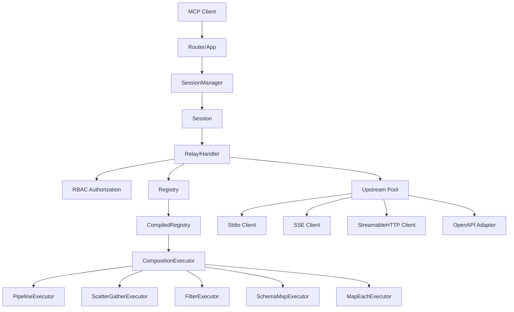

# MCP Handling

## Purpose
The Model Context Protocol (MCP) handling module is the core of agentgateway. It manages MCP client sessions, routes tool/prompt/resource requests to upstream MCP backends, and implements the virtual tools registry with composition patterns.

This is the most actively developed module in this fork — the virtual tool composition system (registry, patterns, executor) is the primary focus of the `agentgatewaygastown` prototype.

## Architecture

## Sub-modules

### Transport (downstream)
- `router.rs` — `App` struct, axum-based HTTP router for incoming MCP requests
- `session.rs` — `Session` and `SessionManager`, per-client session state, stateless mode
- `sse.rs` — Legacy SSE transport (MCP over Server-Sent Events)
- `streamablehttp.rs` — StreamableHTTP transport (modern MCP transport)

### Core Logic
- `handler.rs` — `Relay` struct, the main handler that dispatches requests to backends, merges tool lists, handles virtual tool resolution
- `rbac.rs` — `McpAuthorization`, `McpAuthorizationSet` — RBAC policies for MCP resources (tools, prompts, resources)
- `identity.rs` — `CallerIdentity` — extracts identity from MCP `clientInfo` during initialize
- `mergestream.rs` — Merges streams from multiple upstream backends
- `saga.rs` — Saga pattern support for MCP operations

### Registry (virtual tools)
- `registry/mod.rs` — Top-level registry exports
- `registry/types.rs` — `Registry`, `ToolDefinition`, `VirtualToolDef`, `AgentDefinition`, `Server`
- `registry/compiled.rs` — `CompiledRegistry`, `CompiledTool`, `CompiledComposition` — pre-compiled IR for fast lookup
- `registry/validation.rs` — `RegistryValidator` — validates registry at load time
- `registry/store.rs` — `RegistryStore` — hot-reloadable storage for registry data
- `registry/client.rs` — `RegistryClient` — loads registry from file or HTTP
- `registry/runtime_hooks.rs` — `RuntimeHooks` — caller-based tool visibility, dependency checks

### Patterns (composition DSL)
- `registry/patterns/mod.rs` — `PatternSpec` enum — the core composition patterns
- `registry/patterns/pipeline.rs` — `PipelineSpec`, `PipelineStep` — sequential step execution
- `registry/patterns/scatter_gather.rs` — `ScatterGatherSpec`, `ScatterTarget` — parallel fan-out with aggregation
- `registry/patterns/filter.rs` — `FilterSpec`, `FieldPredicate` — predicate-based result filtering
- `registry/patterns/schema_map.rs` — `SchemaMapSpec`, `FieldSource` — field-level output transformation (ArrayMap, Coalesce, Template, etc.)
- `registry/patterns/map_each.rs` — `MapEachSpec` — per-element array processing
- `registry/patterns/stateful.rs` — Retry, Timeout, Cache, CircuitBreaker, Idempotent, DeadLetter, Saga, ClaimCheck (IR only, no runtime)
- `registry/patterns/vision.rs` — Future pattern ideas

### Executor (runtime)
- `registry/executor/mod.rs` — `CompositionExecutor`, `ExecutionError`
- `registry/executor/pipeline.rs` — `PipelineExecutor` — runs sequential steps
- `registry/executor/scatter_gather.rs` — `ScatterGatherExecutor` — parallel execution + aggregation
- `registry/executor/filter.rs` — `FilterExecutor` — runtime predicate evaluation
- `registry/executor/schema_map.rs` — `SchemaMapExecutor` — field transformation at runtime
- `registry/executor/map_each.rs` — `MapEachExecutor` — per-element processing
- `registry/executor/throttle.rs` — `ThrottleExecutor`, `RateLimiterRegistry`
- `registry/executor/timeout.rs` — `TimeoutExecutor`
- `registry/executor/context.rs` — `ExecutionContext`, `TracingContext`
- `registry/executor/composition_tracing.rs` — Structured tracing for compositions

### Upstream (backend connections)
- `upstream/mod.rs` — Upstream client pool, manages connections to backend MCP servers
- `upstream/client.rs` — Backend MCP client
- `upstream/stdio.rs` — Stdio transport (spawn child process)
- `upstream/sse.rs` — SSE transport to upstream
- `upstream/streamablehttp.rs` — StreamableHTTP transport to upstream
- `upstream/openapi/mod.rs` — OpenAPI-to-MCP adapter (transform legacy REST APIs into MCP tools)

## Key Types
- `App` — The MCP router, manages stores and sessions
- `Session` — Per-client MCP session with caller identity
- `Relay` — Core dispatcher: resolves tool calls to backends or virtual tools
- `CompiledRegistry` — Pre-compiled tool definitions and compositions for fast runtime lookup
- `CompositionExecutor` — Executes compiled compositions (pipelines, scatter-gather, etc.)
- `MCPOperation` — Tool, Prompt, Resource, ResourceTemplates
- `MCPInfo` — Request metadata: method name, resource name, target, session ID

## Dependencies
- **Internal**: [[features/core|Core]], [[features/agentgateway-proxy|Proxy]], [[features/agentgateway-http|HTTP]], [[features/agentgateway-config|Config]]
- **External**: `rmcp` (MCP protocol types), `axum` (HTTP router), `serde_json_path` (JSONPath), `tokio` (async), `sse-stream` (SSE)

## Implementation Status
### Working Runtime Executors
- Source Tool (1:1 mapping)
- Pipeline (sequential execution)
- Scatter-Gather (parallel fan-out with aggregation)
- Filter (predicate-based filtering)
- SchemaMap (field transformation, ArrayMap)
- MapEach (array element processing)
- Output Transform (JSONPath-based output reshaping)
- Throttle (rate limiting)
- Timeout

### IR Only (No Runtime Executor Yet)
- Retry, Cache, CircuitBreaker, Idempotent, DeadLetter, Saga, ClaimCheck

## Notes
- Virtual tools use `VIRTUAL_SERVER_NAME` constant to identify gateway-internal tools
- Registry supports hot-reload via file watch or periodic HTTP polling
- Session supports both stateful and stateless modes (stateless wraps each request in InitializeRequest)
- RBAC evaluates per-resource authorization before dispatching to backends
- CallerIdentity extracted from MCP `clientInfo` during initialize, stored on session for subsequent requests
- See [[references/imported/virtual-tools|Virtual Tools docs]] and [[references/imported/mcp-algebra|MCP Algebra]] for design vision
