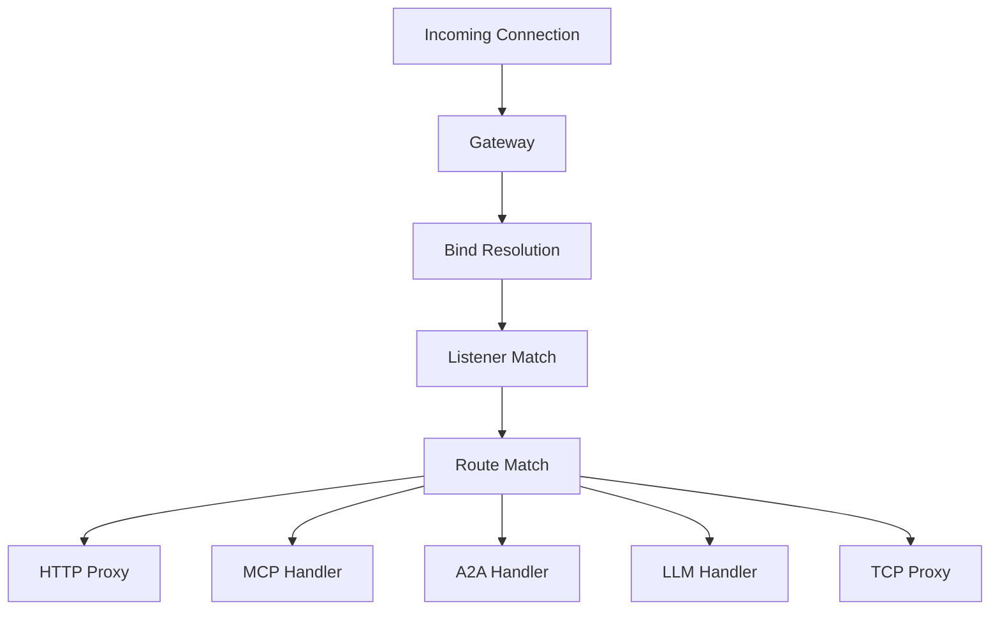

# Proxy Core

## Purpose
Core proxy logic and request routing. The `Gateway` struct is the main entry point that accepts incoming connections, resolves routing (bind → listener → route → backend), and dispatches requests to either MCP, A2A, LLM, or HTTP backends.

## Architecture

## Key Files
- `proxy/mod.rs` — Module root, `ProxyResponse`, `ProxyError` enum with detailed error reasons
- `proxy/gateway.rs` — `Gateway` struct — main entry, connection handling, routing
- `proxy/httpproxy.rs` — HTTP proxy logic, `PolicyClient` for policy enforcement
- `proxy/tcpproxy.rs` — Raw TCP proxying
- `proxy/proxy_protocol.rs` — PROXY protocol (HAProxy) support
- `proxy/request_builder.rs` — Test helper for building proxy requests

## Key Types
- `Gateway` — Top-level proxy entry point
- `ProxyError` — Comprehensive error enum covering routing, auth, upstream, backend errors
- `ProxyResponseReason` — Categorized reasons for proxy responses (NotFound, NoHealthyBackend, Auth failures, etc.)

## Dependencies
- **Internal**: [[features/agentgateway-mcp|MCP]], [[features/agentgateway-http|HTTP]], [[features/agentgateway-a2a|A2A]], [[features/agentgateway-llm|LLM]]
- **Concepts**: [[references/imported/configuration|Configuration Architecture]]

## Notes
- Configuration hierarchy: `binds[] → listeners[] → routes[] → backends[]`
- Routing is resolved at the IR level (shared between local config and XDS)
- ProxyError maps to HTTP status codes and prometheus metrics labels
