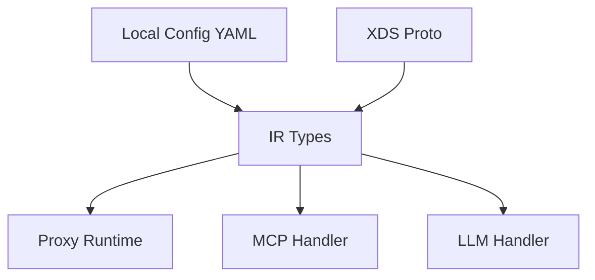

# Types (Internal Representation)

## Purpose
Defines the Internal Representation (IR) — the shared type system used at runtime by both local config and XDS-delivered config. This is the canonical representation of all gateway configuration: binds, listeners, routes, backends, policies, MCP/A2A backends, etc.

## Architecture

## Key Files
- `types/agent.rs` — Core IR types: `Bind`, `Listener`, `Route`, `McpBackend`, `McpTargetSpec`, `ResourceName`, authentication types. The largest and most important file.
- `types/agent_xds.rs` — XDS-to-IR translation
- `types/backend.rs` — Backend definitions (endpoints, load balancing)
- `types/discovery.rs` — Service discovery types (`Service`, `NamespacedHostname`)
- `types/frontend.rs` — Frontend/listener config types
- `types/loadbalancer.rs` — Load balancer algorithm definitions
- `types/local.rs` — Local config parsing types (maps ergonomic YAML to IR)
- `types/proto.rs` — Protobuf type helpers
- `types/stateful.rs` — Stateful session types

## Key Types
- `Bind` — Address binding with listeners
- `Listener` — Hostname matching, routes, protocol
- `Route` / `RouteSet` — Request routing rules
- `McpBackend` — MCP backend with targets, registry, authentication
- `McpTargetSpec` — Spec for individual MCP backend target
- `ResourceName` — Tool/prompt/resource name resolution helpers

## Dependencies
- **Internal**: Referenced by [[features/agentgateway-proxy|Proxy]], [[features/agentgateway-mcp|MCP]], [[features/agentgateway-http|HTTP]]
- **Concepts**: [[references/imported/configuration|Configuration Architecture]]

## Notes
- The configuration hierarchy is `Bind → Listener → Route → Backend`
- Nearly direct mapping between user-facing API, XDS, and IR (avoids fanout problem)
- `ResourceName` handles the `{server}_{tool}` naming convention (known to be a hack — see CLAUDE.md "Design TODO: Proper Tool Algebra")
