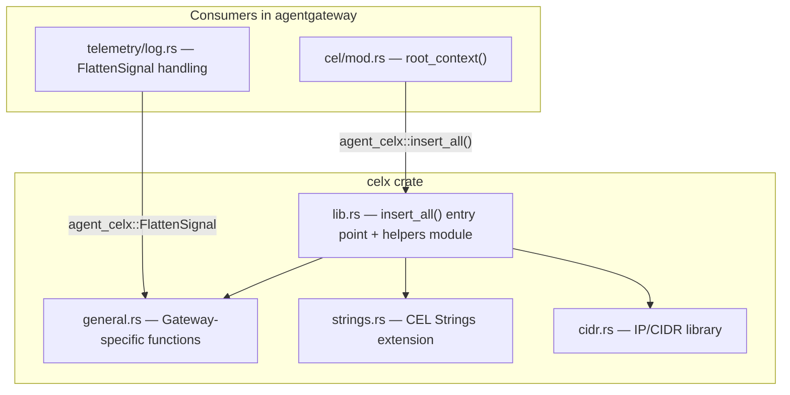

# celx — CEL Expression Evaluation Wrapper

## Purpose

The `celx` crate (`agent-celx`) extends the base `cel-rust` library with custom functions needed by agentgateway for runtime policy evaluation. It provides three function families — general-purpose utilities, string manipulation, and IP/CIDR networking — that are injected into every CEL evaluation context via a single `insert_all()` entry point.

CEL expressions are used throughout the gateway for authorization rules, header modification, rate limiting key extraction, and log/trace field enrichment.

## Architecture



## Key Files

| File | Purpose |
|------|---------|
| `crates/celx/src/lib.rs` | Public entry point (`insert_all`), `helpers` module with type-safe function wrappers (`wrap1`, `wrap2`, `wrapnew`, `split_this`), `impl_opaque!` macro |
| `crates/celx/src/general.rs` | Gateway-specific functions: JSON parse/serialize, base64, flatten, merge, mapValues, with, default, regexReplace, random, uuid, fail, variables |
| `crates/celx/src/strings.rs` | CEL Strings extension (ported from Kuadrant/wasm-shim, Apache 2.0): charAt, indexOf, lastIndexOf, join, lowerAscii, upperAscii, trim, replace, split, substring |
| `crates/celx/src/cidr.rs` | Kubernetes-compatible CIDR/IP library: cidr(), ip(), containsIP, containsCIDR, masked, prefixLength, family, isLoopback, isGlobalUnicast, etc. |
| `crates/celx/src/function_tests.rs` | Unit tests covering all function families |

## Dependencies

| Crate | Usage |
|-------|-------|
| `cel` | Base CEL expression engine (cel-rust) |
| `ipnet` | CIDR/IP network parsing and containment checks |
| `regex` | `regexReplace` function |
| `base64` | `base64Encode` / `base64Decode` |
| `uuid` | `uuid()` v4 generation |
| `rand` | `random()` — uniform float in [0, 1] |
| `serde_json` | JSON parse/serialize (`json()`, `toJson()`) |
| `once_cell` | Lazy static initialization (used by consumers) |

## API Surface

### Entry Point

```rust
pub fn insert_all(ctx: &mut Context<'_>)
```

Registers all custom functions into a CEL `Context`. Called once per gateway lifecycle via `root_context()` in [[components/celx/cel-integration|cel/mod.rs]], stored in a `Lazy<Arc<Context>>`.

### Public Export

```rust
pub use general::FlattenSignal;
```

`FlattenSignal` is an opaque CEL value produced by `flatten()` / `flattenRecursive()`. Consumed by [[features/core|telemetry/log.rs]] to expand map/list values into structured log fields.

### Function Catalog

**General (gateway-specific):**

| Function | Signature | Description |
|----------|-----------|-------------|
| `json(s)` | `string/bytes -> value` | Parse JSON string into CEL value |
| `toJson(v)` / `to_json(v)` | `value -> string` | Serialize CEL value to JSON string |
| `with(v, ident, expr)` | `value.with(x, x + 1)` | Bind value to identifier, evaluate expression |
| `flatten(v)` | `map/list -> FlattenSignal` | Signal to flatten into parent structure |
| `flattenRecursive(v)` / `flatten_recursive(v)` | `map/list -> FlattenSignal` | Recursive flatten |
| `mapValues(m, ident, expr)` | `map.mapValues(v, v * 2)` | Transform all map values |
| `merge(m1, m2)` | `map.merge(other)` | Merge two maps (right wins on conflict) |
| `variables()` | `-> map` | Introspect all variables in current scope |
| `default(expr, fallback)` | `default(a.b, "x")` | Return fallback if expression is null/missing |
| `regexReplace(s, pattern, replacement)` | `str.regexReplace(re, repl)` | Regex-based string replacement |
| `random()` | `-> float` | Random float in [0.0, 1.0] |
| `uuid()` | `-> string` | Generate UUID v4 |
| `base64Encode()` | `str.base64Encode()` | Base64 encode |
| `base64Decode()` | `str.base64Decode()` | Base64 decode to bytes |
| `fail(msg)` | `fail("reason")` | Abort evaluation with error |

**Strings (CEL extension, from cel-go spec):**

| Function | Signature | Description |
|----------|-----------|-------------|
| `charAt(i)` | `str.charAt(n) -> string` | Character at index |
| `indexOf(s, [start])` | `str.indexOf(sub) -> int` | First occurrence (-1 if not found) |
| `lastIndexOf(s, [start])` | `str.lastIndexOf(sub) -> int` | Last occurrence |
| `join([sep])` | `list.join(",") -> string` | Join string list |
| `lowerAscii()` | `str.lowerAscii() -> string` | ASCII lowercase |
| `upperAscii()` | `str.upperAscii() -> string` | ASCII uppercase |
| `trim()` | `str.trim() -> string` | Trim whitespace |
| `replace(from, to, [n])` | `str.replace(a, b) -> string` | String replacement |
| `split(sep, [limit])` | `str.split(",") -> list` | Split string |
| `substring(start, [end])` | `str.substring(2, 5) -> string` | Extract substring |

**CIDR/IP (Kubernetes-compatible):**

| Function | Signature | Description |
|----------|-----------|-------------|
| `cidr(s)` | `cidr("10.0.0.0/8") -> Cidr` | Parse CIDR notation |
| `ip(s)` / `cidr.ip()` | `ip("1.2.3.4") -> IP` | Parse IP or extract from CIDR |
| `containsIP(ip)` | `cidr.containsIP(ip) -> bool` | IP within CIDR range |
| `containsCIDR(c)` | `cidr.containsCIDR(c) -> bool` | CIDR within CIDR range |
| `masked()` | `cidr.masked() -> Cidr` | Network address (zero host bits) |
| `prefixLength()` | `cidr.prefixLength() -> uint` | CIDR prefix length |
| `isIP(s)` | `isIP("1.2.3.4") -> bool` | Validate IP string |
| `family()` | `ip.family() -> uint` | 4 or 6 |
| `isUnspecified()` | `ip.isUnspecified() -> bool` | 0.0.0.0 or :: |
| `isLoopback()` | `ip.isLoopback() -> bool` | 127.x.x.x or ::1 |
| `isLinkLocalMulticast()` | `ip.isLinkLocalMulticast() -> bool` | 224.0.0.x or ff02::/16 |
| `isLinkLocalUnicast()` | `ip.isLinkLocalUnicast() -> bool` | 169.254.x.x or fe80::/10 |
| `isGlobalUnicast()` | `ip.isGlobalUnicast() -> bool` | Globally routable |

## Notes

- The `helpers` module provides a type-safe wrapper system (`wrap1`, `wrap2`, `wrap2_val`, `wrapnew`) that bridges Rust functions to CEL's dynamic dispatch. The `impl_opaque!` macro registers custom Rust types as CEL opaque values with JSON serialization.
- The `split_this` helper handles overloaded functions like `ip()` which behave differently as a free function (`ip("1.2.3.4")`) vs a method call (`cidr.ip()`).
- The strings module is ported from Kuadrant/wasm-shim (Apache 2.0) and tracks the cel-go Strings extension spec. There is an upstream issue (cel-rust#103) to contribute this back.
- `FlattenSignal` is deliberately non-serializable and non-comparable — it is a transient signal consumed only by the telemetry layer to expand structured log fields.
- Both camelCase and snake_case names are registered for some functions (`toJson`/`to_json`, `flattenRecursive`/`flatten_recursive`) for backward compatibility.

## Related

- [[components/celx/cel-integration|CEL Integration]] — how agentgateway consumes celx
- [[components/celx/helpers|Helpers Module]] — type-safe function wrapper system
