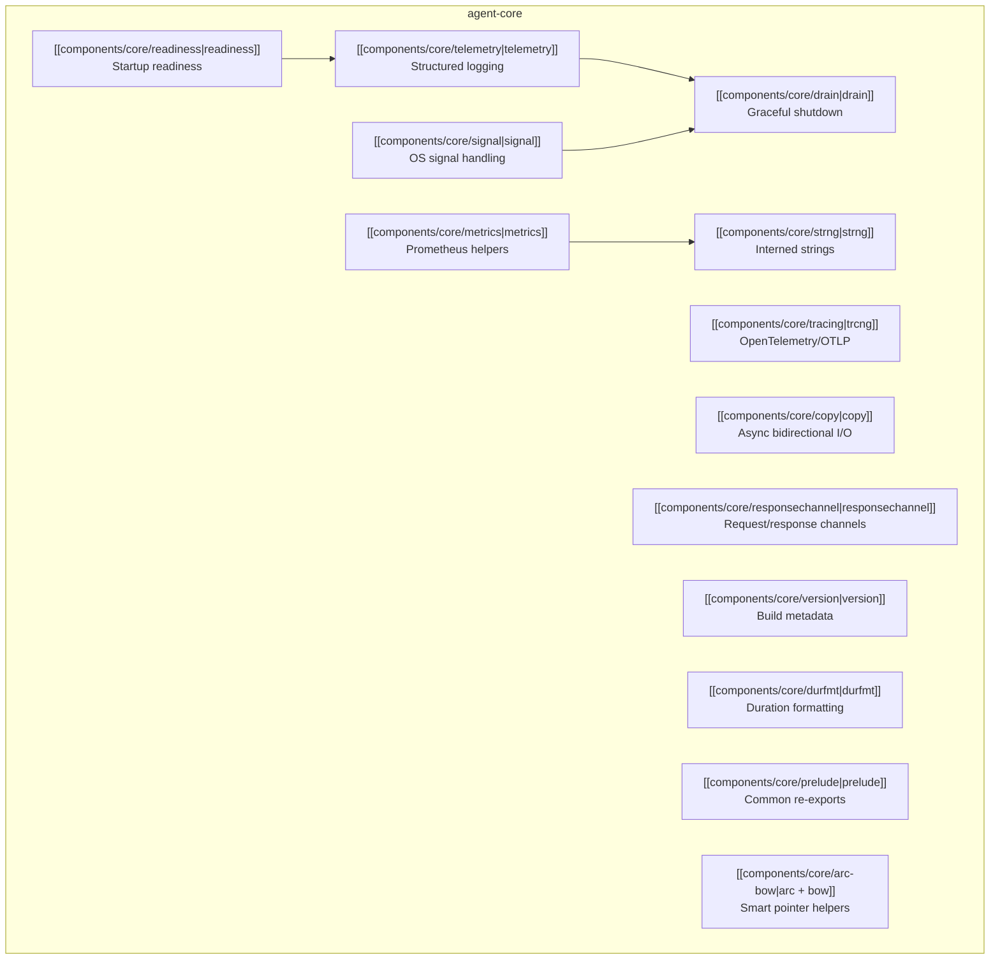

# Core (agent-core)

## Purpose

Foundation crate providing shared primitives for the entire agentgateway workspace. Handles telemetry (structured logging), distributed tracing (OpenTelemetry/OTLP), Prometheus metrics infrastructure, graceful shutdown/drain orchestration, OS signal handling, async I/O copy utilities, and common type abstractions. Every other crate in the workspace depends on `agent-core`.

## Architecture



## Module Overview

| Module | Component | Lines | Purpose |
|--------|-----------|-------|---------|
| `telemetry` | [[components/core/telemetry]] | ~730 | Structured logging with Istio-compatible JSON/plain formats, dynamic log level reload, non-blocking writer thread, cached date formatting, test logger |
| `trcng` | [[components/core/tracing]] | ~150 | OpenTelemetry distributed tracing via OTLP, context propagation, baggage enrichment, custom span tag rules |
| `metrics` | [[components/core/metrics]] | ~305 | Prometheus metrics primitives: `Deferred` RAII recording, `Recorder`/`IncrementRecorder` traits, label encoding helpers (`DefaultedUnknown`, `CustomField`, etc.), Tokio runtime metrics collector |
| `drain` | [[components/core/drain]] | ~500 | Graceful shutdown orchestration: Signal/Watch channel pair, `run_with_drain` with configurable deadline, hyper `GracefulConnection` integration |
| `copy` | [[components/core/copy]] | ~490 | High-performance async bidirectional I/O copy with adaptive buffer resizing (1K to 256K), vectored writes, `BufferedSplitter` trait |
| `signal` | [[components/core/signal]] | ~100 | OS signal handling (SIGINT/SIGTERM on Unix, Ctrl+C on Windows), double-SIGINT force exit |
| `readiness` | [[components/core/readiness]] | ~65 | Startup readiness tracking via RAII `BlockReady` guards |
| `responsechannel` | [[components/core/responsechannel]] | ~60 | Request/response channel using mpsc + oneshot for async send-and-wait patterns |
| `strng` | [[components/core/strng]] | ~93 | Interned string type (`Strng = ArcStr`, 8 bytes, ref-counted, immutable) with `RichStrng` wrapper for Prometheus label encoding |
| `version` | [[components/core/version]] | ~37 | Build metadata struct populated at compile time via `build.rs` |
| `durfmt` | [[components/core/durfmt]] | ~93 | Go-style duration parsing and human-readable formatting with 3-significant-figure rounding |
| `prelude` | [[components/core/prelude]] | ~16 | Common re-exports: std types, `anyhow`, `bytes`, `tokio`, `tracing` macros, `Atomic`/`Strng` |
| `arc` | [[components/core/arc-bow]] | ~7 | Type aliases for `Arc<ArcSwap<T>>` and `Arc<ArcSwapOption<T>>` |
| `bow` | [[components/core/arc-bow]] | ~23 | `OwnedOrBorrowed<T>` enum (like `Cow` without `Clone` requirement) |

## Dependencies

- **Logging**: `tracing`, `tracing-subscriber`, `tracing-appender`, `tracing-core`, `tracing-log`
- **Tracing**: `opentelemetry`, `opentelemetry-otlp`, `opentelemetry_sdk`, `opentelemetry-http`
- **Metrics**: `prometheus-client`
- **Async runtime**: `tokio`, `pin-project-lite`
- **Strings**: `arcstr`
- **Atomic swaps**: `arc-swap`
- **Serialization**: `serde`, `serde_json`
- **Duration parsing**: `go-parse-duration`, `durationfmt`
- **Time**: `time` (for date caching in telemetry)
- **Channels**: `crossbeam-channel` (for non-blocking log writer)
- **HTTP types**: `http`, `hyper-util`
- **Build**: `rustc_version` (build dep for version info)

## API Surface

### Key Exports

```rust
// Prelude (re-exported by most consumers)
pub use crate::prelude::*;  // Arc, Mutex, Duration, tracing macros, Strng, Atomic

// Telemetry
pub fn telemetry::setup_logging(default_level: &str, json: bool) -> WorkerGuard;
pub fn telemetry::set_level(reset: bool, level: &str) -> Result<(), Error>;
pub fn telemetry::log(level: &str, target: &str, kv: &[(&str, Option<ValueBag>)]);

// Tracing
pub fn trcng::init_tracer(config: Config) -> Result<(), ExporterBuildError>;
pub fn trcng::start_span(name, context: &impl Claim) -> SpanBuilder;
pub fn trcng::extract_context_from_request(headers: &HeaderMap) -> Context;

// Metrics
pub fn metrics::sub_registry(registry: &mut Registry) -> &mut Registry;
pub trait metrics::Recorder<E, T> { fn record(&self, event: E, meta: T); }
pub trait metrics::DeferRecorder { fn defer_record(...) -> Deferred; }

// Drain
pub fn drain::new() -> (DrainTrigger, DrainWatcher);
pub async fn drain::run_with_drain(component, drain, deadline, min_delay, make_future);

// Signal
pub struct signal::Shutdown;  // .trigger() -> ShutdownTrigger, .wait()

// Readiness
pub struct readiness::Ready;  // .register_task(name) -> BlockReady (RAII)

// Response Channel
pub fn responsechannel::new<T, R>(buffer) -> (Sender<T, R>, Receiver<T, R>);

// Version
pub struct version::BuildInfo;  // .new() -> compile-time version/git/rustc info
```

## Notes

- **Istio heritage**: Several modules (`telemetry`, `drain`, `signal`, `readiness`) are derived from Istio's ztunnel project (Apache 2.0 licensed). The log format follows Istio conventions.
- **Non-blocking logging**: The telemetry subsystem uses a forked `tracing-appender` with vectored I/O batching (groups of 64 writes) and adaptive backpressure. This is critical for high-throughput proxy workloads.
- **Date caching**: The `telemetry/date.rs` module caches the formatted date string per-thread, updating only once per second. Date formatting was measured as ~50% of log cost.
- **Adaptive buffer sizing**: The `copy` module starts with 1KB buffers and grows to 16KB after 128KB transferred, then to 256KB after 10MB. Inspired by Go's TLS connection buffer strategy.
- **Build info**: `build.rs` runs `common/scripts/report_build_info.sh` to capture git revision and version at compile time, plus rustc version and build profile.
- **Metrics prefix**: All Prometheus metrics are prefixed with `agentgateway` via `metrics::PREFIX`.
