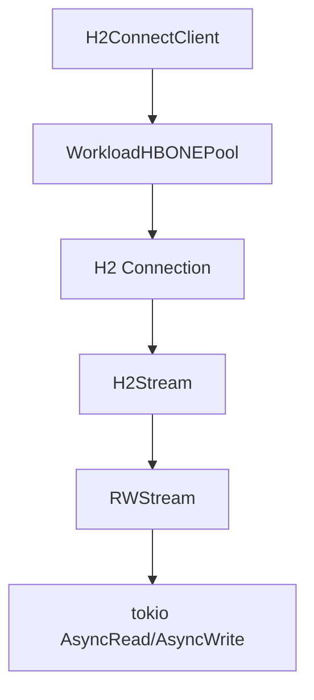

# HBONE (HTTP/2 CONNECT Tunneling)

## Purpose
Provides HTTP/2 CONNECT-based tunneling (HBONE — HTTP-Based Overlay Network Encapsulation). Used for multiplexing proxied workload connections over a smaller number of HTTP/2 mTLS tunnels. Originates from Istio's ambient mesh architecture.

## Architecture

## Key Files
- `crates/hbone/src/lib.rs` — Core types: `H2Stream`, `RWStream`, `H2StreamReadHalf`/`WriteHalf`, `Config`, ping-pong keepalive, `Key` trait
- `crates/hbone/src/client.rs` — `H2ConnectClient<K>` wrapper over h2, manages stream sending/receiving, connection lifecycle
- `crates/hbone/src/pool.rs` — `WorkloadHBONEPool<K>` — HTTP/2 connection pool with per-workload keying, multiplexed streams, TLS certificate fetching via `CertificateFetcher` trait
- `crates/hbone/src/server.rs` — Server-side H2 connection handling

## Key Types
- `Key` trait — `Display + Clone + Hash + Debug + Eq + Send + Sync + 'static` with `fn dest() -> SocketAddr`
- `H2ConnectClient<K>` — Wraps h2 `SendRequest`, tracks stream count, checks max streams
- `WorkloadHBONEPool<K>` — Connection pool using `pingora_pool::ConnectionPool` internally, with per-key locking via `flurry::HashMap`
- `RWStream` — Adapts `H2Stream` to `tokio::io::AsyncRead + AsyncWrite`
- `Config` — Window size, connection window size, frame size, pool max streams, unused release timeout

## Dependencies
- **Internal**: [[features/core|Core]] (`agent_core::copy`, `agent_core::prelude`)
- **External**: `h2` (HTTP/2), `tokio`, `pingora-pool` (connection pooling), `rustls` (TLS), `flurry` (concurrent hashmap)

## Pool Invariants
- Every workload gets its own connection pool
- Every unique src/dest key gets dedicated connections
- Connections are multiplexed (1-N per key, practically limited by flow control)
- Idle connections released after configurable timeout
- Ping-pong keepalive at 10s intervals, 20s timeout

## Notes
- `DropCounter` uses `Arc` reference counting to track when both halves of a stream are dropped before decrementing the active stream count
- The pool uses `pingora_pool::ConnectionPool` as a convenience data structure — it handles keyed LRU eviction but no HTTP/connection logic
