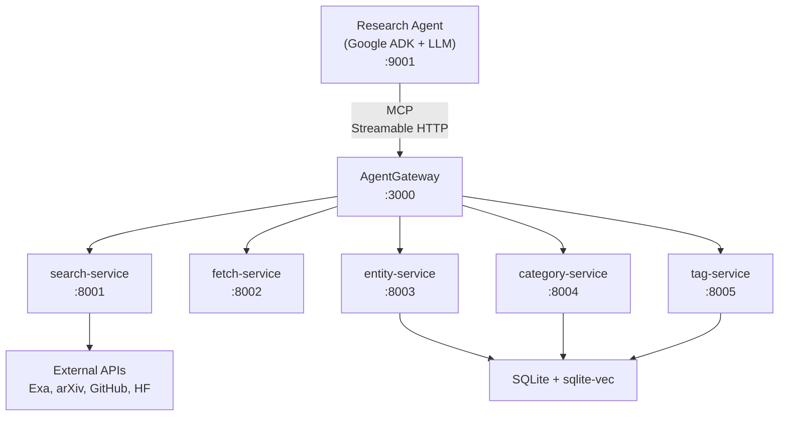

# Research Assistant Demo

The primary testbed for virtual tool composition in agentgateway. This is the only demo marked **Working** in the project's CLAUDE.md, and serves as the reference implementation for scatter-gather, pipeline, arrayMap transforms, and the [[interfaces/registry-format|Registry Format]].

## Purpose

Demonstrates how the gateway composes 5 intentionally decoupled MCP microservices into coherent research workflows using [[concepts/virtual-tool-composition|Virtual Tool Composition]]. Rather than building a monolithic research service, functionality is split across small focused backends, with the gateway providing orchestration via declarative JSON — no code required for composition.

## Architecture



## Composition Patterns Demonstrated

All patterns use [[decisions/chose-declarative-composition|Declarative Composition]] via the registry JSON.

### 1. OutputTransform with ArrayMap
Normalizes heterogeneous backend responses into a common `NormalizedSearchResult` schema using `arrayMap` + `coalesce` + `literal` mappings. Four wrapper tools (`web_research`, `normalized_arxiv`, `normalized_github`, `normalized_huggingface`) each transform their backend's native format.

### 2. Scatter-Gather
`multi_source_search` runs all 4 normalized wrappers in parallel, then aggregates with `extract -> flatten -> dedupe -> wrap`. Produces a single unified result array. `failFast: false` ensures partial results on source failures.

### 3. Pipeline
`fetch_and_extract` chains `url_fetch -> extract_urls` with data flowing via JSONPath step references. `store_research_finding` forwards to a backend tool with schema remapping.

### 4. Nested Composition (Pipeline + Scatter-Gather)
`research_and_fetch` is the "mega-tool": a 3-step pipeline where Step 1 is an inline scatter-gather (entity_search + search_categories + multi_source_search), Step 2 is batch_fetch on result URLs, and Step 3 is a schemaMap reshaping the output.

## Tool Inventory

| Layer | Tools | Count |
|-------|-------|-------|
| Compositions | `research_and_fetch`, `multi_source_search`, `academic_search`, `code_search` | 4 |
| Normalizers (arrayMap) | `web_research`, `normalized_arxiv`, `normalized_github`, `normalized_huggingface` | 4 |
| Pipelines | `fetch_and_extract`, `explore_entity_network`, `get_knowledge_for_topic` | 3 |
| Forwarding/alias | `store_research_finding`, `link_entities`, `find_or_create_category`, `browse_taxonomy` | 4 |
| Backend (raw) | All tools from 5 services | ~25 |
| **Total exposed** | Full registry | ~40+ |

The **minimal registry** exposes only 10 tools: `research_and_fetch`, `multi_source_search`, 4 normalizers, and 4 KG write tools.

## Registry Format

The registry JSON uses `schemaVersion: "2.0"` with three top-level sections:
- **schemas**: Reusable JSON Schema definitions (`NormalizedSearchResult`, `NormalizedSearchResponse`, `Entity`, `Category`)
- **servers**: Backend service declarations with `provides` tool lists
- **tools**: Virtual tool definitions with `source`, `spec`, `outputTransform`, `inputSchema`, `outputSchema`

See [[components/research-assistant-demo/registry-config|Registry Config]] for full details.

## Running the Demo

```bash
# Build gateway
cargo build -p agentgateway-app

# Start everything (5 services + gateway + agent + web UI)
cd examples/research-assistant-demo
./start_services.sh

# Or minimal (10 tools)
./start_services.sh gateway-configs/minimal_config.yaml
```

Web UI at http://localhost:8080, CLI chat via `uv run python chat_cli.py`.

## Current Status

- **42 tests passing**, 2 skipped (need Exa API key) -- see [[components/research-assistant-demo/test-infrastructure|Test Infrastructure]]
- Agent uses Google ADK with auto-detected LLM (Anthropic > OpenAI > Google)
- Tool call logging with timing at INFO, full I/O at DEBUG
- Gateway validates outputSchema at startup with coalesce default warnings

## Components

- [[components/research-assistant-demo/backend-services|Backend Services]] -- 5 MCP microservices
- [[components/research-assistant-demo/registry-config|Registry Config]] -- virtual tool definitions
- [[components/research-assistant-demo/test-infrastructure|Test Infrastructure]] -- pytest integration tests

## Related

- [[features/agentgateway-mcp|MCP handling]] -- gateway MCP session management
- [[concepts/virtual-tool-composition|Virtual Tool Composition]] -- composition patterns
- [[interfaces/registry-format|Registry Format]] -- registry JSON specification
- [[decisions/chose-declarative-composition|Declarative Composition]] -- design rationale
