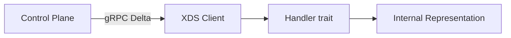

# XDS (Dynamic Configuration Protocol)

## Purpose
Implements the XDS (eXtensible Discovery Service) transport protocol client for receiving dynamic configuration from a remote control plane. Uses Envoy's gRPC transport protocol but with **purpose-built protobuf types** (not Envoy resource types like Listener/Cluster).

## Architecture

## Key Files
- `crates/xds/src/lib.rs` — Error types, re-exports. Error enum covers gRPC status, transport, MPSC send failures
- `crates/xds/src/client.rs` — Main XDS client implementation. Uses Delta Discovery (incremental updates). Manages subscriptions, demand-based resource requests, ACK/NACK handling
- `crates/xds/src/types.rs` — Protobuf codegen inclusion (`tonic::include_proto!("envoy.service.discovery.v3")`), `ResourceKey`, `RejectedConfig`, `XdsUpdate<T>`, `handle_single_resource` helper
- `crates/xds/src/metrics.rs` — Connection metrics (termination reasons, connection counts)

## Key Types
- `ResourceKey` — `(name: Strng, type_url: Strng)` identifier for XDS resources
- `RejectedConfig` — Name + reason for NACK'd configurations
- `XdsUpdate<T>` — Generic wrapper for resource updates (add/remove)
- `handle_single_resource` — Helper that processes updates one-by-one, aggregating errors as NACKs
- `Error` — `GrpcStatus`, `Connection`, `Transport`, `RequestFailure`, `OnDemandSend`

## Dependencies
- **Internal**: [[features/core|Core]] (`agent_core::metrics`, `agent_core::strng`)
- **External**: `tonic` (gRPC), `prost`/`prost-types` (protobuf), `tokio` (async runtime)

## Design Principles
- Resources point UP to parents (not parent containing child list) — avoids fanout problem
- One HTTPRoute rule = one agentgateway Route
- Policies sent as-is with reference to where they apply; precedence resolved at runtime
- See [[references/imported/configuration|Configuration Architecture]] for the three-layer config model

## Notes
- Uses Delta Discovery (not SoTW) — only changed resources are sent
- Helpful error hints: detects "authentication failure" and "DNS resolution" errors and adds suggestions
- `Strng` type from `agent_core::strng` used throughout (interned string type)
