# vMCP: A Compositional Algebra for AI Tool Integration

## The Problem

AI agents today have access to an explosion of tools via MCP servers—filesystems, databases, APIs, search engines, SaaS platforms, but **no principled way to compose them**. Every multi-tool workflow devolves into imperative glue code: manual schema translation, ad-hoc error handling, copy-pasted retry logic, and bespoke aggregation. The result is brittle, opaque pipelines that can't be reused, tested, or reasoned about.

Consider a simple task: *"Research a topic across multiple sources and summarize findings."* Today this requires an agent to:
- Invoke 3-4 search tools with different schemas
- Manually normalize results to a common format  
- Filter, deduplicate, and rank across sources
- Handle failures, retries, and timeouts per-tool
- Wire up logging and observability as an afterthought

This isn't tool *use*, it's tool *plumbing*. And it's the same plumbing, repeated ad infinitum across every agent and workflow.

There's a deeper tension here: **agent developers own the tokens**. Every byte that enters the LLM context counts against a finite budget--latency, cost, and attention all scale with context size. This ownership is *bidirectional*:

- **Input side**: Tool names, descriptions, and input schemas are injected into the LLM's context at decision time. A verbose 500-word description or a 20-field input schema consumes tokens before any tool is even called. Generic descriptions like "Query the database" don't help the LLM select the right tool; overly technical schemas like `soql: string` force the LLM to generate domain-specific syntax it may hallucinate.

- **Output side**: Tool results flow back into context for the LLM to reason over. A tool returning 50 fields when the agent needs 2 is pure waste, every excess field dilutes attention and burns budget.

Agent developers *need* control over both directions: curating tool descriptions to guide selection, simplifying input schemas to reduce errors, and filtering outputs to minimize context bloat. But MCP tools are black boxes. You either accept their interface verbatim -- descriptions, schemas, outputs, and all, or reimplement them from scratch. The choice today is: cede control of your context window to upstream tool authors, or rebuild every tool yourself with the exact interface you need.

Neither option scales. Agent developers shouldn't have to fork every MCP server to add a filter. They shouldn't reimplement a perfectly good Salesforce connector just to reshape its output. **They need composition without reimplementation**-- the ability to wrap, transform, and orchestrate primitive tools while preserving the underlying functionality.

**What if tools composed like functions?** What if `scatter_gather`, `normalize`, `circuit_breaker`, and `retry` were first-class primitives you could snap together declaratively, the way Apache Camel transformed enterprise integration from custom point-to-point connections into composable routing algebra?

---

## The Vision

The way Apache Camel essentially provides an algebra over integration endpoints, a compositional DSL where routes, transformers, and patterns are first-class combinators. Applying this to MCP servers gives us a **Tool Integration Algebra**—composable primitives for orchestrating, transforming, and routing across heterogeneous MCP tool ecosystems.

---

## The Core Analogy

| Apache Camel | MCP Tool Algebra |
|--------------|------------------|
| Endpoint (HTTP, JMS, FTP...) | MCP Server/Tool |
| Message | Tool Input/Output (JSON) |
| Route | Tool Pipeline/Workflow |
| Component | MCP Server Adapter |
| Exchange | Tool Invocation Context |
| Processor | Tool Result Transformer |

---

## The Value Proposition

**Camel's value over raw APIs:**
- Uniform abstraction over 300+ protocols
- Declarative routing logic
- Built-in patterns for common integration problems
- Error handling, retry, circuit breaking as first-class

**MCP Algebra's value over raw tool calls:**
- Uniform abstraction over heterogeneous MCP servers (filesystem, database, web, custom)
- Declarative tool orchestration without imperative glue code
- Built-in patterns for multi-tool workflows
- Composable error handling, fallbacks, and observability
- **Schema-aware transformations** between tools with different input/output shapes

---

## System Architecture

The vMCP Runtime is the core component that implements the Tool Integration Algebra. It integrates with the MCP Registry for tool discovery and composition, while agents interact through the registry to access both primitive and composed tools.


```mermaid
%%{init: {'theme': 'base', 'themeVariables': { 'fontSize': '18px' }}}%%
graph LR
    subgraph AGENTS["Agent Layer"]
        direction TB
        A1[Coding Agent]
        A2[Research Agent]
        A3[Data Agent]
        A4[Service Agent]
    end

    subgraph REGISTRY["MCP Registry"]
        direction TB
        DISC[Server Discovery]
        CAT[Server Catalog]
        SCHEMA[Schema Repository]
        HEALTH[Health Monitor]
    end

    subgraph VMCP["vMCP Runtime"]
        direction TB
        COMPOSER[Composition Engine]
        PATTERNS[Pattern Library]
        EXEC[Execution Layer]
    end

    subgraph SERVERS["MCP Server Ecosystem"]
        direction TB
        subgraph PRIMITIVE["Primitive MCP Servers"]
            FS[Filesystem]
            DB[Database]
            WEB[Web Search]
            CRM[Salesforce]
            SLACK[Slack]
            CUSTOM[Custom APIs]
        end
        subgraph VSERVERS["vMCP Servers"]
            VS1[research_pipeline]
            VS2[enriched_customer]
            VS3[multi_source_search]
        end
    end

    %% High-level connections (one arrow per relationship)
    AGENTS -->|discover| REGISTRY
    AGENTS -->|invoke| SERVERS
    REGISTRY -->|register + monitor| SERVERS
    VMCP -->|orchestrate calls| PRIMITIVE
    VSERVERS -.->|runs in| VMCP
    
    %% Styling
    style AGENTS fill:#f472b622,stroke:#f472b6,stroke-width:2px
    style REGISTRY fill:#a78bfa22,stroke:#a78bfa,stroke-width:2px
    style VMCP fill:#22c55e22,stroke:#22c55e,stroke-width:2px
    style SERVERS fill:#4a9eff22,stroke:#4a9eff,stroke-width:2px
    style VSERVERS fill:#22c55e33,stroke:#22c55e,stroke-width:1px
    style PRIMITIVE fill:#4a9eff11,stroke:#4a9eff
```

### Functional Components

| Component | Responsibility |
|-----------|----------------|
| **Agent Layer** | AI agents that consume composed tools. Agents don't need to know about individual MCP servers—they discover and invoke composed tools through the registry. |
| **MCP Registry** | Central catalog of available tools (both primitive and composed). Provides discovery, schema introspection, and health monitoring. |
| **vMCP Runtime** | The Tool Integration Algebra implementation. Composes primitive tools into higher-order tools using patterns. |
| **MCP Server Ecosystem** | Heterogeneous collection of MCP servers providing primitive tool capabilities. |

### vMCP Runtime Internals

| Subcomponent | Function |
|--------------|----------|
| **DSL Parser** | Parses declarative tool composition definitions (pipelines, routers, etc.) |
| **Execution Planner** | Builds execution DAGs from composed tool definitions, handles parallelization |
| **Query Optimizer** | Optimizes execution plans (caching, batching, short-circuiting) |
| **Pattern Library** | Reusable composition patterns (pipeline, scatter-gather, circuit breaker, etc.) |
| **Orchestrator** | Executes plans, manages tool invocations, handles data flow |
| **Result Cache** | Memoization layer for idempotent operations |
| **Retry Handler** | Implements retry policies, backoff, dead letter handling |
| **Distributed Tracer** | Observability—traces tool invocations across composed workflows |

### Interaction Flow

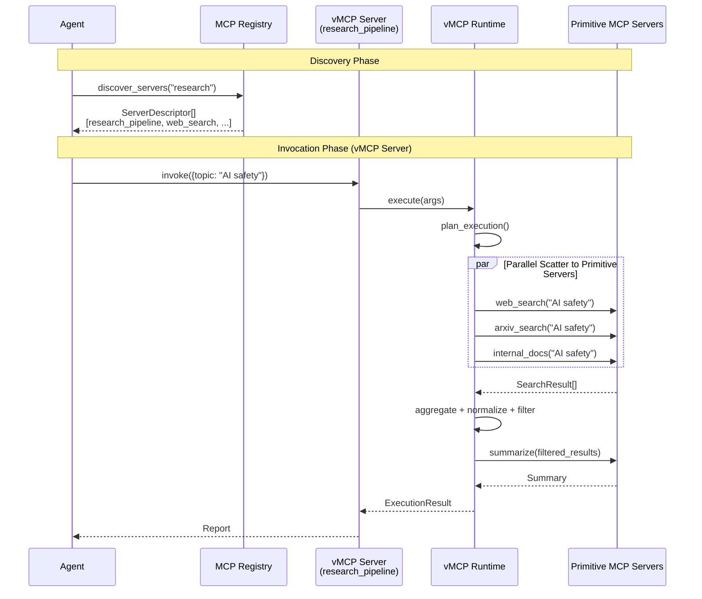
```mermaid
sequenceDiagram
    participant Agent
    participant Registry as MCP Registry
    participant vMCPServer as vMCP Server<br/>(research_pipeline)
    participant vMCP as vMCP Runtime
    participant Primitive as Primitive MCP Servers

    Note over Agent,Primitive: Discovery Phase
    Agent->>Registry: discover_servers("research")
    Registry-->>Agent: ServerDescriptor[]<br/>[research_pipeline, web_search, ...]

    Note over Agent,Primitive: Invocation Phase (vMCP Server)
    Agent->>vMCPServer: invoke({topic: "AI safety"})
    vMCPServer->>vMCP: execute(args)
    
    vMCP->>vMCP: plan_execution()
    
    par Parallel Scatter to Primitive Servers
        vMCP->>Primitive: web_search("AI safety")
        vMCP->>Primitive: arxiv_search("AI safety")
        vMCP->>Primitive: internal_docs("AI safety")
    end
    
    Primitive-->>vMCP: SearchResult[]
    vMCP->>vMCP: aggregate + normalize + filter
    vMCP->>Primitive: summarize(filtered_results)
    Primitive-->>vMCP: Summary
    
    vMCP-->>vMCPServer: ExecutionResult
    vMCPServer-->>Agent: Report
```

### Key Design Principles

1. **Agents discover via Registry, invoke servers directly** — Agents use the MCP Registry to find available servers (both primitive and vMCP), but invoke them directly without the registry in the call path.

2. **Composition is transparent** — A vMCP server (`research_pipeline`) appears identical to a primitive server (`web_search`) from the agent's perspective. Both are registered, both have schemas, both are directly invocable.

3. **Registry is the source of truth for discovery** — All server metadata (schemas, capabilities, health status) is registered in and discovered from the registry. vMCP servers register themselves alongside primitive servers.

4. **vMCP Runtime orchestrates primitive servers** — When an agent invokes a vMCP server, the vMCP Runtime handles execution by orchestrating calls to primitive MCP servers using the composition patterns.

5. **Observability is built-in** — Every invocation (primitive or composed) is traced, enabling debugging of complex multi-server workflows.

---

## Enterprise Integration Patterns -> MCP Tool Patterns

### 1. **Pipeline (Sequential Processing)**

*Chain tool calls where each output feeds the next input.*

**Camel:**
```java
// Types: Route<A,D> = from<Void,A> -> to<A,B> -> to<B,C> -> to<C,D>
// Each .to() composes: Endpoint<I,O> -> Route<_,I> -> Route<_,O>
from("direct:start")              // Route<Void, Request>
    .to("http://serviceA")        // Route<Void, ResponseA>
    .to("jms:queue:process")      // Route<Void, ResponseB>
    .to("http://serviceB");       // Route<Void, ResponseC>
```

**MCP Algebra:**
```
// Component tools
web_search:      (query: string) -> SearchResult[]
extract_urls:    (results: SearchResult[]) -> URL[]
web_fetch:       (urls: URL[]) -> Document[]
summarize:       (docs: Document[]) -> Summary

// Composed tool
research_pipeline: (query: string) -> Summary

pipeline(
    web_search("latest AI papers"),
    extract_urls,
    web_fetch(urls),
    summarize
)
```

**Example:** Search -> Fetch -> Summarize -> Store

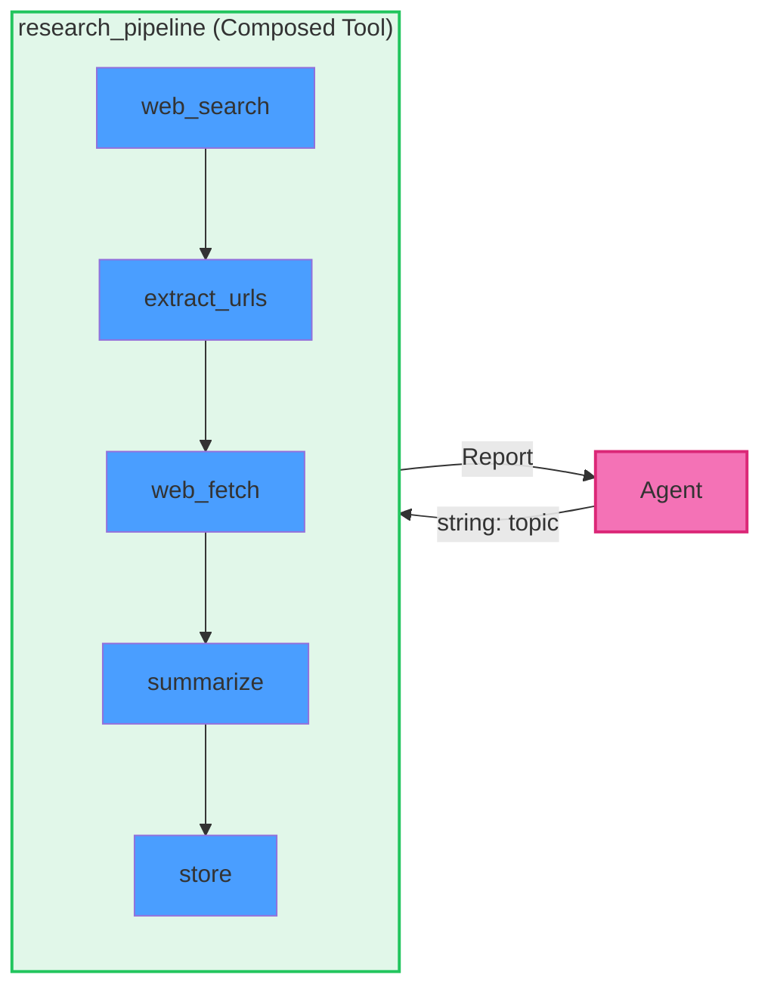
```mermaid
graph LR
    AGENT[Agent] -->|"string: topic"| COMPOSED
    subgraph COMPOSED["research_pipeline (Composed Tool)"]
        A[web_search] --> B[extract_urls]
        B --> C[web_fetch]
        C --> D[summarize]
        D --> E[store]
    end
    COMPOSED -->|"Report"| AGENT
    
    style AGENT fill:#f472b6,stroke:#db2777,stroke-width:2px
    style A fill:#4a9eff
    style B fill:#4a9eff
    style C fill:#4a9eff
    style D fill:#4a9eff
    style E fill:#4a9eff
    style COMPOSED fill:#22c55e22,stroke:#22c55e,stroke-width:2px
```

---

### 2. **Content-Based Router**

*Route to different tools based on input content.*

**Camel:**
```java
// Types: Route<A, B|C|D> = choice<A> -> (Predicate<A> × Endpoint<A,B>)* -> Endpoint<A,D>
// choice() lifts Route into ChoiceDefinition; when() is (Pred × Route) coproduct
from("direct:start")                                    // Route<Void, Doc>
    .choice()                                           // ChoiceDefinition<Doc>
        .when(header("type").isEqualTo("pdf"))          // Predicate<Doc>
            .to("pdf-processor")                        // -> Route<Doc, PdfResult>
        .when(header("type").isEqualTo("csv"))          // Predicate<Doc>
            .to("csv-processor")                        // -> Route<Doc, CsvResult>
        .otherwise().to("generic-processor");           // -> Route<Doc, GenericResult>
// Result: Route<Void, PdfResult | CsvResult | GenericResult>
```

**MCP Algebra:**
```
// Component tools
pdf_tool.extract_text:    (file: File) -> ExtractedText
xlsx_tool.read_sheet:     (file: File) -> ExtractedText
docx_tool.parse:          (file: File) -> ExtractedText
generic_text_extractor:   (file: File) -> ExtractedText

// Composed tool
analyze_document: (file: File) -> ExtractedText

route(input) {
    when(input.file_type == "pdf")  -> pdf_tool.extract_text
    when(input.file_type == "xlsx") -> xlsx_tool.read_sheet
    when(input.file_type == "docx") -> docx_tool.parse
    otherwise                       -> generic_text_extractor
}
```

**Example:** A universal "analyze document" operation that dispatches to the right MCP server based on file type.

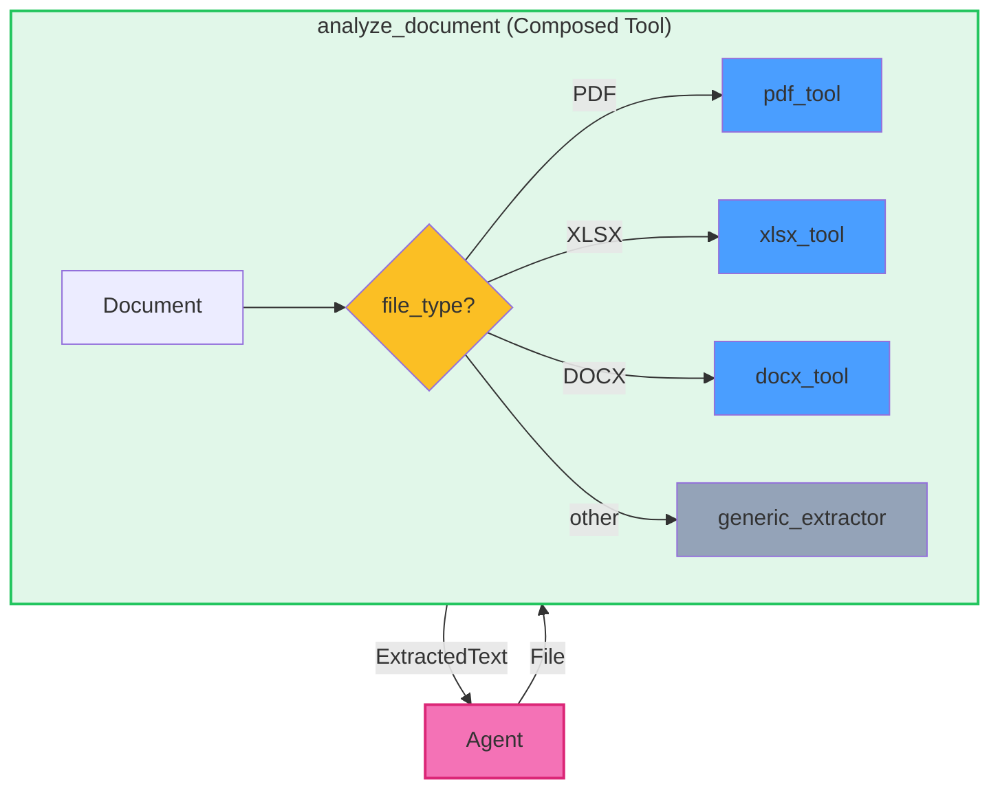
```mermaid
graph TD
    AGENT[Agent] -->|"File"| COMPOSED
    subgraph COMPOSED["analyze_document (Composed Tool)"]
        A[Document] --> B{file_type?}
        B -->|PDF| C[pdf_tool]
        B -->|XLSX| D[xlsx_tool]
        B -->|DOCX| E[docx_tool]
        B -->|other| F[generic_extractor]
    end
    COMPOSED -->|"ExtractedText"| AGENT
    
    style AGENT fill:#f472b6,stroke:#db2777,stroke-width:2px
    style B fill:#fbbf24
    style C fill:#4a9eff
    style D fill:#4a9eff
    style E fill:#4a9eff
    style F fill:#94a3b8
    style COMPOSED fill:#22c55e22,stroke:#22c55e,stroke-width:2px
```

---

### 3. **Splitter**

*Split a collection and process each item independently.*

**Camel:**
```java
// Types: Route<List<A>, List<B>> = split<List<A>, A> -> map(Endpoint<A,B>) -> collect
// split() is a functor: F<A> -> (A -> B) -> F<B>
from("direct:start")                  // Route<Void, String>
    .split(body().tokenize("\n"))     // SplitDefinition<String, Line> (String -> Line[])
    .to("direct:processLine");        // foreach: Route<Line, ProcessedLine>
// Result: Route<Void, List<ProcessedLine>>
```

**MCP Algebra:**
```
// Component tools
file_list:        (path: string) -> FilePath[]
read_file:        (path: FilePath) -> FileContent
analyze_content:  (content: FileContent) -> Analysis
store_result:     (analysis: Analysis) -> StorageRef

// Composed tool
batch_analyze: (dir_path: string) -> AnalysisResult[]

split(
    source: file_list("/documents"),
    foreach: item -> pipeline(
        read_file(item),
        analyze_content,
        store_result
    )
)
```

**Example:** Given a directory listing, process each file through an analysis pipeline.

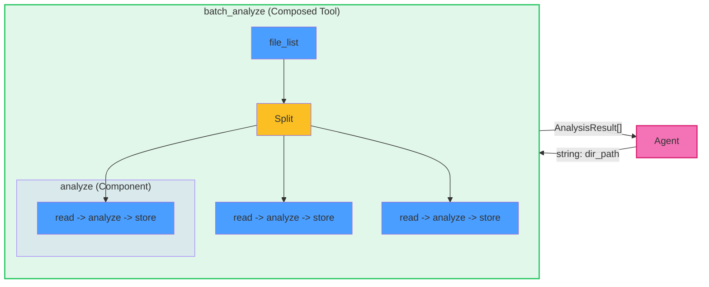
```mermaid
graph LR
    AGENT[Agent] -->|"string: dir_path"| COMPOSED
    subgraph COMPOSED["batch_analyze (Composed Tool)"]
        A["file_list"] --> B[Split]
        subgraph INNER["analyze (Component)"]
            C1["read -> analyze -> store"]
        end
        B --> C1
        B --> C2["read -> analyze -> store"]
        B --> C3["read -> analyze -> store"]
    end
    COMPOSED -->|"AnalysisResult[]"| AGENT
    
    style AGENT fill:#f472b6,stroke:#db2777,stroke-width:2px
    style A fill:#4a9eff
    style B fill:#fbbf24
    style C1 fill:#4a9eff
    style C2 fill:#4a9eff
    style C3 fill:#4a9eff
    style INNER fill:#a78bfa22,stroke:#a78bfa
    style COMPOSED fill:#22c55e22,stroke:#22c55e,stroke-width:2px
```

---

### 4. **Aggregator**

*Collect results from multiple operations and combine them.*

**Camel:**
```java
// Types: Route<List<A>, C> = split -> map(f) -> fold(aggregator, zero)
// aggregate() is a fold/reduce: List<B> × (C × B -> C) × C -> C
from("direct:start")                           // Route<Void, List<Item>>
    .split(body()).to("direct:process")        // Route<Item, Processed>
    .aggregate(                                // AggregateDefinition<Processed, Batch>
        header("correlationId"),               // KeyExtractor<Processed, CorrelationId>
        new MyAggregationStrategy())           // BiFunction<Batch, Processed, Batch>
    .completionSize(10);                       // CompletionPredicate (|batch| ≥ 10)
// Result: Route<Void, Batch>
```

**MCP Algebra:**
```
// Component tools
web_search:      (query: string) -> SearchResult[]
database_query:  (sql: string) -> Record[]

// Aggregation strategy
merge_and_deduplicate: (results: SearchResult[][]) -> SearchResult[]

// Composed tool
multi_source_search: (query: string) -> SearchResult[]

aggregate(
    sources: [
        web_search("topic from source A"),
        web_search("topic from source B"),
        database_query("SELECT * FROM cache WHERE topic = ?")
    ],
    strategy: merge_and_deduplicate,
    completion: all_complete
)
```

**Example:** Multi-source research—search web, query internal DB, fetch from API—then merge results.

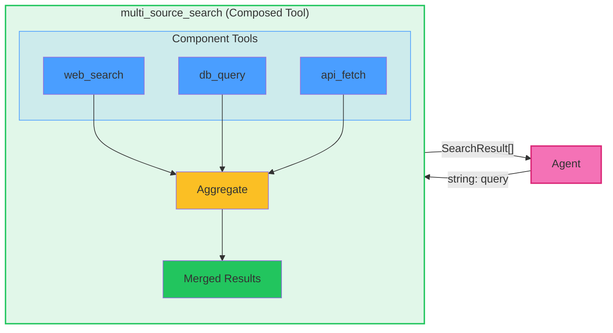
```mermaid
graph LR
    AGENT[Agent] -->|"string: query"| COMPOSED
    subgraph COMPOSED["multi_source_search (Composed Tool)"]
        subgraph COMPONENTS["Component Tools"]
            A[web_search]
            B[db_query]
            C[api_fetch]
        end
        A --> D[Aggregate]
        B --> D
        C --> D
        D --> E[Merged Results]
    end
    COMPOSED -->|"SearchResult[]"| AGENT
    
    style AGENT fill:#f472b6,stroke:#db2777,stroke-width:2px
    style A fill:#4a9eff
    style B fill:#4a9eff
    style C fill:#4a9eff
    style D fill:#fbbf24
    style E fill:#22c55e
    style COMPONENTS fill:#4a9eff22,stroke:#4a9eff
    style COMPOSED fill:#22c55e22,stroke:#22c55e,stroke-width:2px
```

---

### 5. **Scatter-Gather (Parallel Multicast + Aggregate)**

*Send same request to multiple tools in parallel, aggregate responses.*

**Camel:**
```java
// Types: Route<A, D> = multicast<A, (B,C,D)> × aggregate<(B,C,D), R>
// multicast is product: A -> (A->B) × (A->C) × (A->D) -> (B,C,D)
from("direct:start")                           // Route<Void, Request>
    .multicast(new MyAggregationStrategy())    // MulticastDefinition<Request, (R1,R2,R3), Agg>
    .parallelProcessing()                      // execution: Par (vs Seq)
    .to("http://vendor1",                      // Endpoint<Request, Response1>
        "http://vendor2",                      // Endpoint<Request, Response2>
        "http://vendor3");                     // Endpoint<Request, Response3>
// Aggregator: (Response1, Response2, Response3) -> AggregatedResponse
// Result: Route<Void, AggregatedResponse>
```

**MCP Algebra:**
```
// Component tools
mcp_server_a.search:  (query: string) -> SearchResult[]
mcp_server_b.search:  (query: string) -> SearchResult[]
web_search:           (query: string) -> SearchResult[]

// Aggregation function
best_of: (ranking: RankingFn) -> (results: SearchResult[][]) -> RankedAnswer

// Composed tool
knowledge_search: (question: string) -> RankedAnswer

scatter_gather(
    request: { query: "best practices for X" },
    targets: [
        mcp_server_a.search,
        mcp_server_b.search,
        web_search
    ],
    aggregate: best_of(ranking_function),
    timeout: 5s
)
```

**Example:** Query multiple knowledge bases in parallel, return best combined answer.

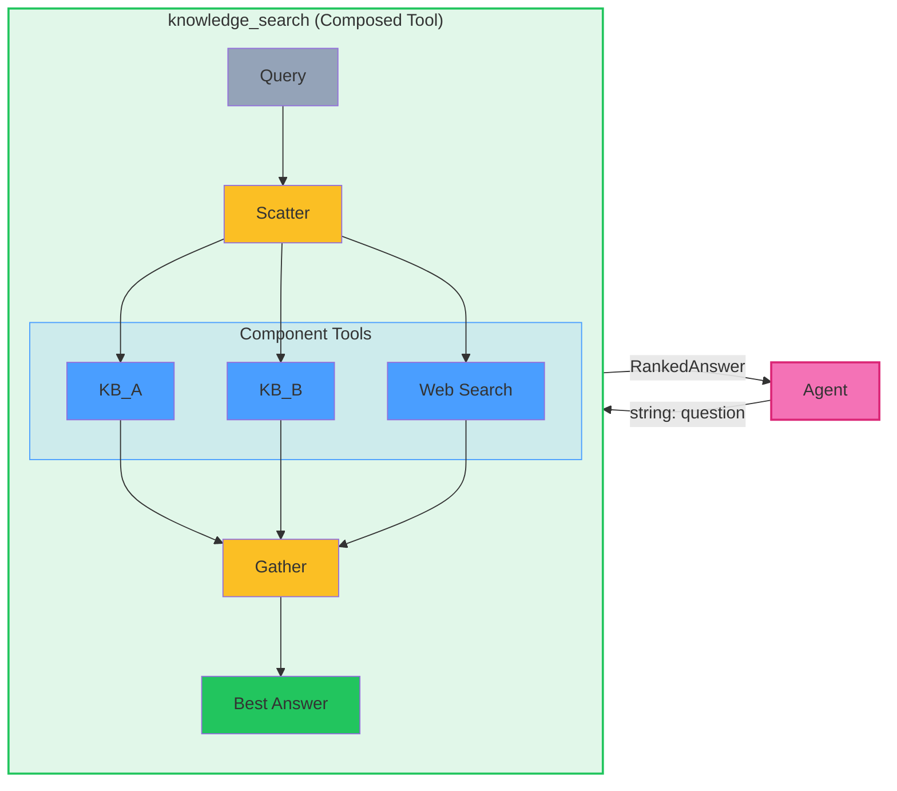
```mermaid
graph LR
    AGENT[Agent] -->|"string: question"| COMPOSED
    subgraph COMPOSED["knowledge_search (Composed Tool)"]
        Q[Query] --> S[Scatter]
        subgraph COMPONENTS["Component Tools"]
            A[KB_A]
            B[KB_B]
            C[Web Search]
        end
        S --> A
        S --> B
        S --> C
        A --> G[Gather]
        B --> G
        C --> G
        G --> R[Best Answer]
    end
    COMPOSED -->|"RankedAnswer"| AGENT
    
    style AGENT fill:#f472b6,stroke:#db2777,stroke-width:2px
    style Q fill:#94a3b8
    style S fill:#fbbf24
    style A fill:#4a9eff
    style B fill:#4a9eff
    style C fill:#4a9eff
    style G fill:#fbbf24
    style R fill:#22c55e
    style COMPONENTS fill:#4a9eff22,stroke:#4a9eff
    style COMPOSED fill:#22c55e22,stroke:#22c55e,stroke-width:2px
```

---

### 6. **Enricher (Content Enricher)**

*Augment data by calling additional tools.*

**Camel:**
```java
// Types: Route<A, C> = enrich<A, B, C> where C = merge(A, B)
// enrich is: A × (A -> B) × ((A,B) -> C) -> C
from("direct:start")                              // Route<Void, Original>
    .enrich("http://enrichment-service",          // Endpoint<Original, Enrichment>
            enrichStrategy);                      // BiFunction<Original, Enrichment, Merged>
// Result: Route<Void, Merged>
```

**MCP Algebra:**
```
// Component tools
crm_tool.get_history:  (id: CustomerId) -> CustomerHistory
web_search:            (query: string) -> WebPresence
sentiment_analysis:    (text: string) -> SentimentScore

// Merge function
merge: (base: CustomerRecord, enrichments: Enrichment[]) -> EnrichedCustomer

// Composed tool
get_enriched_customer: (record: CustomerRecord) -> EnrichedCustomer

enrich(
    base: customer_record,
    with: [
        crm_tool.get_history(customer_record.id),
        web_search(customer_record.company_name),
        sentiment_analysis(customer_record.last_email)
    ],
    merge: (base, enrichments) -> { ...base, ...enrichments }
)
```

**Example:** Take a basic record, enrich with CRM data, web presence, sentiment scores.

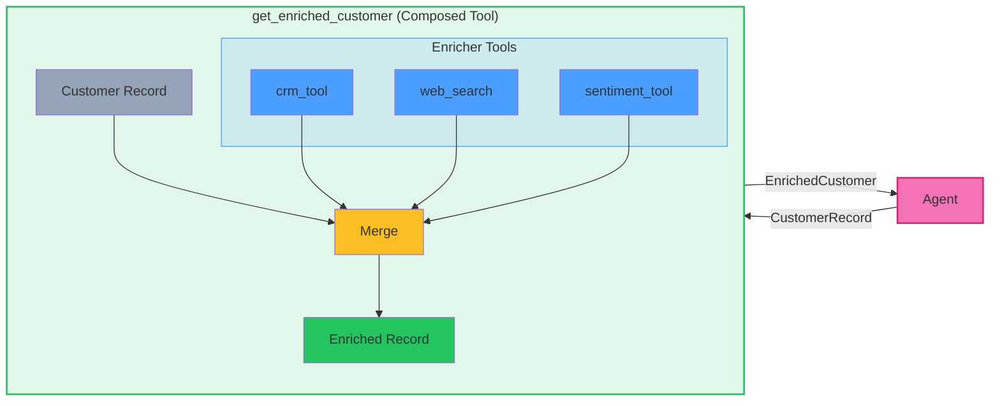
```mermaid
graph LR
    AGENT[Agent] -->|"CustomerRecord"| COMPOSED
    subgraph COMPOSED["get_enriched_customer (Composed Tool)"]
        A[Customer Record] --> M[Merge]
        subgraph ENRICHERS["Enricher Tools"]
            B[crm_tool]
            C[web_search]
            D[sentiment_tool]
        end
        B --> M
        C --> M
        D --> M
        M --> E[Enriched Record]
    end
    COMPOSED -->|"EnrichedCustomer"| AGENT
    
    style AGENT fill:#f472b6,stroke:#db2777,stroke-width:2px
    style A fill:#94a3b8
    style B fill:#4a9eff
    style C fill:#4a9eff
    style D fill:#4a9eff
    style M fill:#fbbf24
    style E fill:#22c55e
    style ENRICHERS fill:#4a9eff22,stroke:#4a9eff
    style COMPOSED fill:#22c55e22,stroke:#22c55e,stroke-width:2px
```

---

### 7. **Normalizer**

*Convert heterogeneous tool outputs to a common schema.*

**Camel:**
```java
// Types: (A | B) -> Canonical via coproduct elimination
// normalizer: ∀T. T -> (T -> Canonical) -> Canonical  (type-indexed transform)
from("jms:queue:A").to("direct:normalize");   // Route<Void, FormatA>
from("http://serviceB").to("direct:normalize"); // Route<Void, FormatB>

from("direct:normalize")                       // Route<Void, FormatA | FormatB>
    .choice()
        .when(header("source").isEqualTo("A")) // Predicate: isFormatA
            .bean(NormalizerA.class)           // Function<FormatA, Canonical>
        .when(header("source").isEqualTo("B")) // Predicate: isFormatB
            .bean(NormalizerB.class)           // Function<FormatB, Canonical>
    .end()
    .to("direct:process");                     // Endpoint<Canonical, Result>
// Result: Route<FormatA | FormatB, Canonical>
```

**MCP Algebra:**
```
// Component tools (heterogeneous output schemas)
gdrive_search:      (query: string) -> GDriveResult[]     // {name, link, mimeType}
slack_search:       (query: string) -> SlackMessage[]     // {title, url, ts, channel}
confluence_search:  (query: string) -> ConfluencePage[]   // {page, href, space}

// Target schema
type UnifiedDocument = {
    title: string,
    content: string,
    source: string,
    timestamp: datetime,
    url: string
}

// Composed tool
unified_doc_search: (query: string) -> UnifiedDocument[]

normalize(
    sources: {
        google_drive: gdrive_search("quarterly reports"),
        slack: slack_search("quarterly reports"),
        confluence: confluence_search("quarterly reports")
    },
    to_schema: UnifiedDocument
)
```

**Example:** Search across Google Drive, Slack, Confluence—normalize all results to common document schema.


```mermaid
graph LR
    AGENT[Agent] -->|"string: query"| COMPOSED
    subgraph COMPOSED["unified_doc_search (Composed Tool)"]
        subgraph SOURCES["Source Tools (heterogeneous schemas)"]
            A["gdrive_search<br/>{name,link}"]
            B["slack_search<br/>{title,url,ts}"]
            C["confluence_search<br/>{page,href}"]
        end
        A --> N[Normalize]
        B --> N
        C --> N
        N --> D["Unified<br/>{title,content,source,url}"]
    end
    COMPOSED -->|"UnifiedDocument[]"| AGENT
    
    style AGENT fill:#f472b6,stroke:#db2777,stroke-width:2px
    style A fill:#ea4335
    style B fill:#4a154b
    style C fill:#0052cc
    style N fill:#fbbf24
    style D fill:#22c55e
    style SOURCES fill:#4a9eff22,stroke:#4a9eff
    style COMPOSED fill:#22c55e22,stroke:#22c55e,stroke-width:2px
```

---

### 8. **Filter**

*Conditionally pass or block messages.*

**Camel:**
```java
// Types: Route<A, A> = filter<A>(Predicate<A>) — partial identity
// filter is: A -> (A -> Bool) -> Option<A>  (or A filtered)
from("direct:start")                        // Route<Void, Message>
    .filter(body().contains("important"))   // Predicate<Message> -> FilterDefinition<Message>
    .to("direct:process");                  // Endpoint<Message, Processed>
// Only messages satisfying predicate flow through
// Result: Route<Void, Processed>  (for subset of inputs)
```

**MCP Algebra:**
```
// Component tools
web_search:  (query: string) -> SearchResult[]
summarize:   (results: SearchResult[]) -> Summary

// Filter predicates
is_recent:   (result: SearchResult) -> boolean
is_trusted:  (result: SearchResult) -> boolean

// Composed tool
filtered_search: (query: string) -> Summary

pipeline(
    web_search("news about company X"),
    filter(result -> result.date > days_ago(7)),
    filter(result -> result.source in trusted_sources),
    summarize
)
```

**Example:** Filter search results to only recent items from trusted sources before processing.

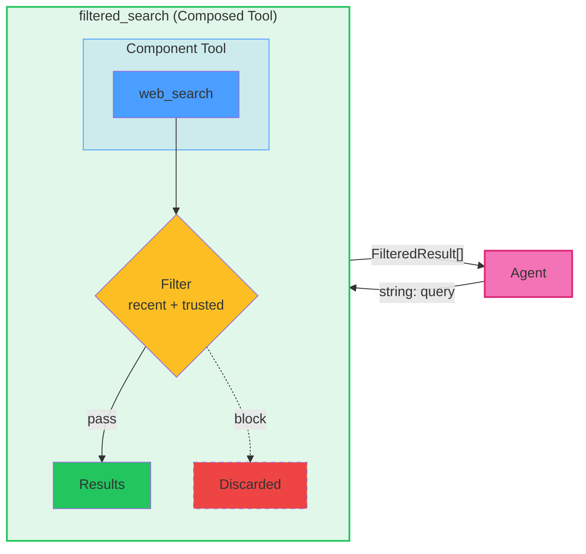
```mermaid
graph LR
    AGENT[Agent] -->|"string: query"| COMPOSED
    subgraph COMPOSED["filtered_search (Composed Tool)"]
        subgraph INNER["Component Tool"]
            A[web_search]
        end
        A --> F{Filter<br/>recent + trusted}
        F -->|pass| B[Results]
        F -.->|block| C[Discarded]
    end
    COMPOSED -->|"FilteredResult[]"| AGENT
    
    style AGENT fill:#f472b6,stroke:#db2777,stroke-width:2px
    style A fill:#4a9eff
    style F fill:#fbbf24
    style B fill:#22c55e
    style C fill:#ef4444,stroke-dasharray: 5 5
    style INNER fill:#4a9eff22,stroke:#4a9eff
    style COMPOSED fill:#22c55e22,stroke:#22c55e,stroke-width:2px
```

---

### 9. **Recipient List (Dynamic Routing)**

*Determine targets at runtime.*

**Camel:**
```java
// Types: Route<A, List<B>> = recipientList<A, List<Endpoint<A,B>>>
// Dynamic dispatch: A -> (A -> List<Endpoint>) -> List<B>
from("direct:start")                       // Route<Void, Request>
    .recipientList(header("destinations")); // Expression<Request, List<EndpointURI>>
// At runtime: Request.destinations -> ["svc1", "svc2"] -> invoke each
// Result: Route<Void, List<Response>>
```

**MCP Algebra:**
```
// Component tools (dynamically selected)
statistical_tool:    (data: Dataset) -> StatisticalAnalysis
ml_tool:             (data: Dataset) -> MLPrediction
visualization_tool:  (data: Dataset) -> Visualization

// Tool selector
determine_tools: (type: AnalysisType) -> Tool[]

// Composed tool
dynamic_analysis: (request: AnalysisRequest) -> AnalysisResult[]

recipient_list(
    message: analysis_request,
    recipients: determine_tools(analysis_request.type),
    // returns ["statistical_tool", "ml_tool", "visualization_tool"] dynamically
)
```

**Example:** Based on analysis type requested, dynamically determine which set of tools to invoke.

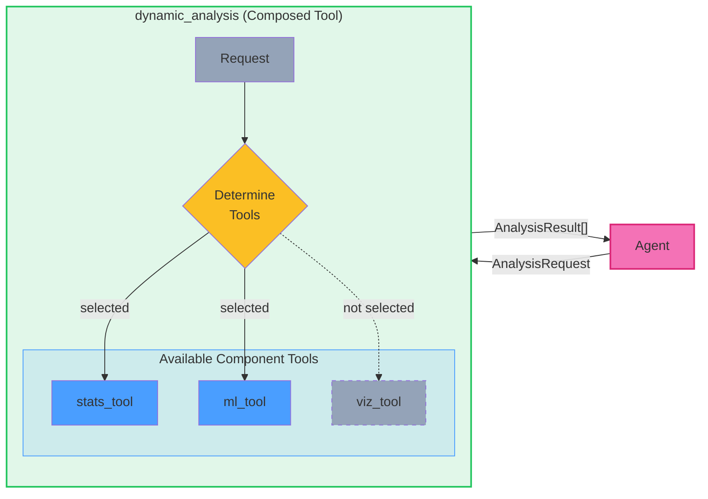
```mermaid
graph LR
    AGENT[Agent] -->|"AnalysisRequest"| COMPOSED
    subgraph COMPOSED["dynamic_analysis (Composed Tool)"]
        A[Request] --> D{Determine<br/>Tools}
        subgraph POOL["Available Component Tools"]
            T1[stats_tool]
            T2[ml_tool]
            T3[viz_tool]
        end
        D -->|selected| T1
        D -->|selected| T2
        D -.->|not selected| T3
    end
    COMPOSED -->|"AnalysisResult[]"| AGENT
    
    style AGENT fill:#f472b6,stroke:#db2777,stroke-width:2px
    style A fill:#94a3b8
    style D fill:#fbbf24
    style T1 fill:#4a9eff
    style T2 fill:#4a9eff
    style T3 fill:#94a3b8,stroke-dasharray: 5 5
    style POOL fill:#4a9eff22,stroke:#4a9eff
    style COMPOSED fill:#22c55e22,stroke:#22c55e,stroke-width:2px
```

---

### 10. **Wire Tap (Observability)**

*Copy data to a side channel without affecting main flow.*

**Camel:**
```java
// Types: Route<A, B> = wireTap<A, Void> × Route<A, B>
// wireTap is: A -> (A -> Void) × (A -> B) -> B  (side-effect + main flow)
from("direct:start")                // Route<Void, Request>
    .wireTap("jms:queue:audit")     // Endpoint<Request, Void> (async, fire-forget)
    .to("http://mainService");      // Endpoint<Request, Response>
// wireTap clones message, sends copy; original continues to main
// Result: Route<Void, Response>  (+ side-effect to audit)
```

**MCP Algebra:**
```
// Component tools (main pipeline)
fetch_document:    (doc_id: string) -> RawDocument
process_document:  (doc: RawDocument) -> ProcessedDocument
store_result:      (doc: ProcessedDocument) -> StorageRef

// Observer tools (side effects only)
audit_logger.log:         (event: PipelineEvent) -> void
metrics_collector.record: (event: PipelineEvent) -> void

// Composed tool
audited_pipeline: (doc_id: string) -> ProcessedDocument

wiretap(
    main: pipeline(
        fetch_document,
        process_document,
        store_result
    ),
    tap: audit_logger.log,  // receives copy of each intermediate result
    tap: metrics_collector.record
)
```

**Example:** Log all tool invocations and results for debugging/compliance without modifying the main pipeline.

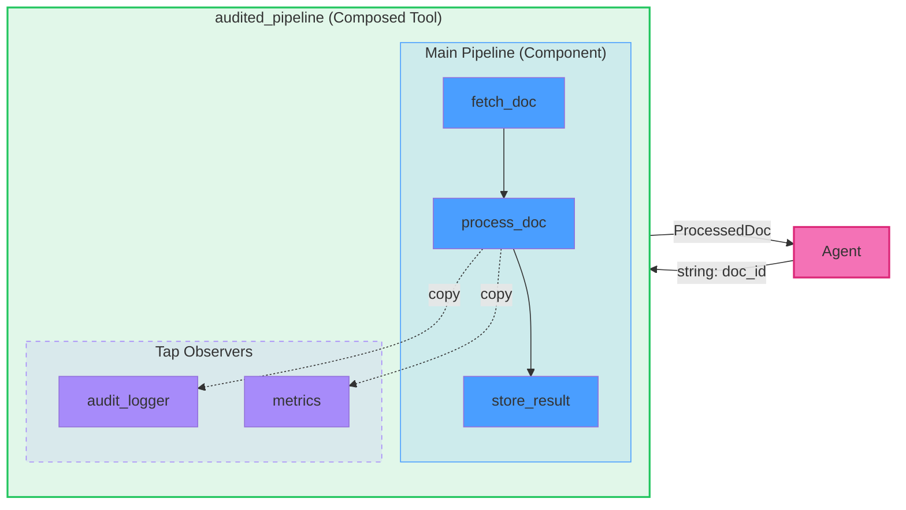
```mermaid
graph LR
    AGENT[Agent] -->|"string: doc_id"| COMPOSED
    subgraph COMPOSED["audited_pipeline (Composed Tool)"]
        subgraph MAIN["Main Pipeline (Component)"]
            A[fetch_doc] --> B[process_doc] --> C[store_result]
        end
        subgraph TAPS["Tap Observers"]
            T[audit_logger]
            M[metrics]
        end
        B -.->|copy| T
        B -.->|copy| M
    end
    COMPOSED -->|"ProcessedDoc"| AGENT
    
    style AGENT fill:#f472b6,stroke:#db2777,stroke-width:2px
    style A fill:#4a9eff
    style B fill:#4a9eff
    style C fill:#4a9eff
    style T fill:#a78bfa
    style M fill:#a78bfa
    style MAIN fill:#4a9eff22,stroke:#4a9eff
    style TAPS fill:#a78bfa22,stroke:#a78bfa,stroke-dasharray: 5 5
    style COMPOSED fill:#22c55e22,stroke:#22c55e,stroke-width:2px
```

---

### 11. **Dead Letter Channel**

*Handle failed tool invocations gracefully.*

**Camel:**
```java
// Types: Route<A, B | Error> -> Route<A, B>  (error absorption)
// deadLetter: (A -> B throws E) -> Endpoint<E, Void> -> (A -> B)
errorHandler(
    deadLetterChannel("jms:queue:errors")  // Endpoint<Exchange<Error>, Void>
        .maximumRedeliveries(3)            // RetryPolicy: Nat
        .redeliveryDelay(1000));           // BackoffPolicy: Duration
// Wraps route: failures -> retry(3) -> deadLetter -> continue
// Transforms: Route<A, B | Error> into Route<A, B>
```

**MCP Algebra:**
```
// Component tools
web_fetch:              (url: string) -> WebContent
parse:                  (content: WebContent) -> ParsedData
analyze:                (data: ParsedData) -> Analysis
error_store.save:       (error: FailedRequest) -> void
cached_result_or_default: () -> Analysis

// Composed tool
resilient_fetch: (url: string) -> Analysis | FallbackResult

with_error_handling(
    pipeline: [web_fetch(url), parse, analyze],
    on_error: {
        retry: 3,
        backoff: exponential(base: 1s),
        dead_letter: error_store.save,
        fallback: cached_result_or_default
    }
)
```

**Example:** If web_fetch fails after retries, store the failed request and return cached/default data.

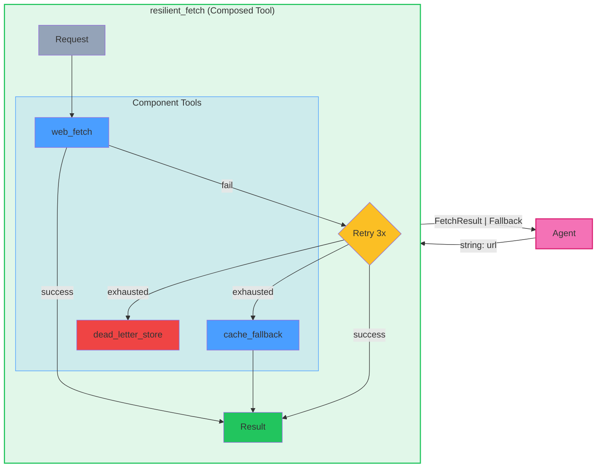
```mermaid
graph LR
    AGENT[Agent] -->|"string: url"| COMPOSED
    subgraph COMPOSED["resilient_fetch (Composed Tool)"]
        A[Request] --> B[web_fetch]
        B -->|success| C[Result]
        B -->|fail| R{Retry 3x}
        R -->|success| C
        R -->|exhausted| D[dead_letter_store]
        R -->|exhausted| F[cache_fallback]
        F --> C
        
        subgraph COMPONENTS["Component Tools"]
            B
            D
            F
        end
    end
    COMPOSED -->|"FetchResult | Fallback"| AGENT
    
    style AGENT fill:#f472b6,stroke:#db2777,stroke-width:2px
    style A fill:#94a3b8
    style B fill:#4a9eff
    style R fill:#fbbf24
    style C fill:#22c55e
    style D fill:#ef4444
    style F fill:#4a9eff
    style COMPONENTS fill:#4a9eff22,stroke:#4a9eff
    style COMPOSED fill:#22c55e22,stroke:#22c55e,stroke-width:2px
```

---

### 12. **Circuit Breaker**

*Protect against cascading failures from unreliable MCP servers.*

**Camel:**
```java
// Types: Route<A, B | C> = circuitBreaker<A, B> × fallback<A, C>
// CB is a state machine: Closed -> (failures > n) -> Open -> (timeout) -> HalfOpen
from("direct:start")                    // Route<Void, Request>
    .circuitBreaker()                   // CircuitBreakerDefinition<Request, Response>
        .to("http://unreliableService") // Endpoint<Request, Response> (guarded)
    .onFallback()                       // FallbackDefinition<Request, Fallback>
        .to("direct:fallback");         // Endpoint<Request, Fallback>
// State: Closed -> try primary; Open -> skip to fallback; HalfOpen -> test primary
// Result: Route<Void, Response | Fallback>
```

**MCP Algebra:**
```
// Component tools
external_api_tool.call:  (request: APIRequest) -> APIResponse
local_cache.get:         (request: APIRequest) -> CachedResponse

// Composed tool
protected_api_call: (request: APIRequest) -> APIResponse | CachedResponse

circuit_breaker(
    tool: external_api_tool.call,
    failure_threshold: 5,
    reset_timeout: 30s,
    fallback: local_cache.get
)
```

**Example:** If an external MCP server fails repeatedly, trip the circuit and use local fallback.

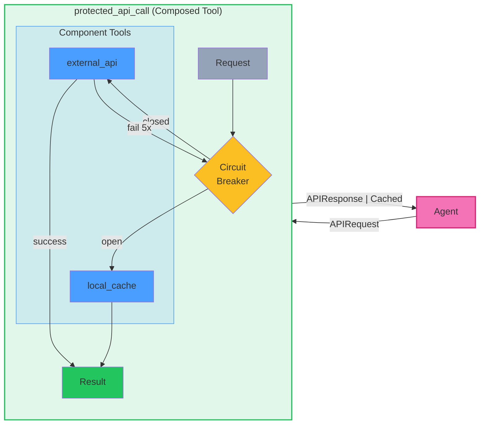
```mermaid
graph LR
    AGENT[Agent] -->|"APIRequest"| COMPOSED
    subgraph COMPOSED["protected_api_call (Composed Tool)"]
        A[Request] --> CB{Circuit<br/>Breaker}
        subgraph COMPONENTS["Component Tools"]
            B[external_api]
            F[local_cache]
        end
        CB -->|closed| B
        CB -->|open| F
        B -->|success| R[Result]
        B -->|fail 5x| CB
        F --> R
    end
    COMPOSED -->|"APIResponse | Cached"| AGENT
    
    style AGENT fill:#f472b6,stroke:#db2777,stroke-width:2px
    style A fill:#94a3b8
    style CB fill:#fbbf24
    style B fill:#4a9eff
    style F fill:#4a9eff
    style R fill:#22c55e
    style COMPONENTS fill:#4a9eff22,stroke:#4a9eff
    style COMPOSED fill:#22c55e22,stroke:#22c55e,stroke-width:2px
```

---

### 13. **Throttler / Rate Limiter**

*Control rate of tool invocations.*

**Camel:**
```java
// Types: Route<A, B> = throttle<Nat, Duration> × Route<A, B>
// throttle: Rate × (A -> B) -> (A -> Delayed<B>)  (backpressure)
from("direct:start")                         // Route<Void, Request>
    .throttle(100).timePeriodMillis(1000)    // ThrottleDefinition: 100 msg/1000ms
    .to("http://rateLimitedService");        // Endpoint<Request, Response>
// Exceeding rate: queue/delay subsequent requests
// Result: Route<Void, Response>  (rate-bounded)
```

**MCP Algebra:**
```
// Component tool
api_tool.call: (request: APIRequest) -> APIResponse

// Composed tool
rate_limited_api: (request: APIRequest) -> APIResponse

throttle(
    tool: api_tool.call,
    rate: 100 per minute,
    strategy: token_bucket,
    on_exceeded: queue | reject | wait
)
```

**Example:** Ensure we don't exceed API rate limits when batch-processing through an MCP tool.

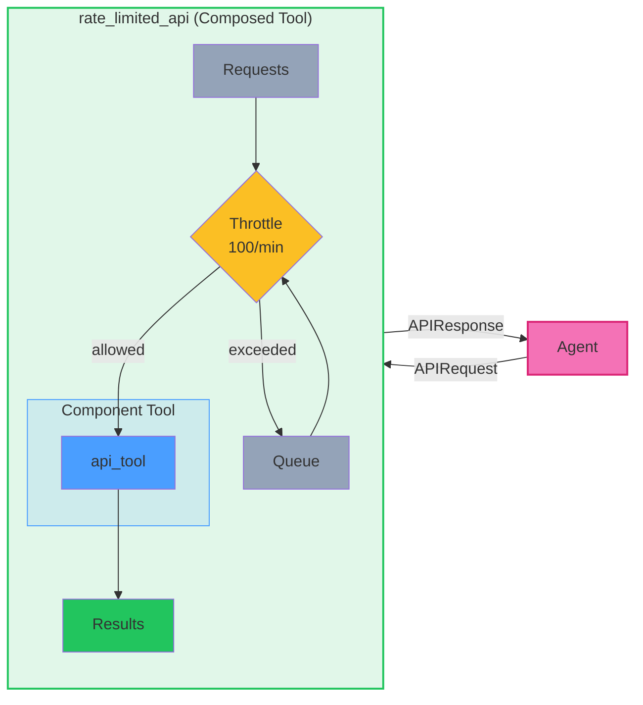
```mermaid
graph LR
    AGENT[Agent] -->|"APIRequest"| COMPOSED
    subgraph COMPOSED["rate_limited_api (Composed Tool)"]
        A[Requests] --> T{Throttle<br/>100/min}
        T -->|allowed| B[api_tool]
        T -->|exceeded| Q[Queue]
        Q --> T
        B --> R[Results]
        
        subgraph COMPONENT["Component Tool"]
            B
        end
    end
    COMPOSED -->|"APIResponse"| AGENT
    
    style AGENT fill:#f472b6,stroke:#db2777,stroke-width:2px
    style A fill:#94a3b8
    style T fill:#fbbf24
    style Q fill:#94a3b8
    style B fill:#4a9eff
    style R fill:#22c55e
    style COMPONENT fill:#4a9eff22,stroke:#4a9eff
    style COMPOSED fill:#22c55e22,stroke:#22c55e,stroke-width:2px
```

---

### 14. **Idempotent Consumer**

*Prevent duplicate processing.*

**Camel:**
```java
// Types: Route<A, B> = idempotent<A, Key> × Route<A, B>
// idempotent: (A -> Key) × Store<Key> × (A -> B) -> (A -> B)  (at-most-once)
from("jms:queue:orders")                      // Route<Void, Order>
    .idempotentConsumer(
        header("orderId"),                    // Expression<Order, OrderId>  (key extractor)
        repo)                                 // IdempotentRepository<OrderId>  (seen-set)
    .to("direct:process");                    // Endpoint<Order, ProcessedOrder>
// If orderId ∈ repo: skip; else: process, repo.add(orderId)
// Result: Route<Void, ProcessedOrder>  (deduplicated)
```

**MCP Algebra:**
```
// Component tool
expensive_analysis_tool: (request: AnalysisRequest) -> AnalysisResult

// Cache operations
result_cache.get:  (key: CacheKey) -> AnalysisResult | null
result_cache.set:  (key: CacheKey, value: AnalysisResult, ttl: Duration) -> void

// Composed tool
cached_analysis: (request: AnalysisRequest) -> AnalysisResult

idempotent(
    key: request -> hash(request.document_id, request.operation),
    tool: expensive_analysis_tool,
    cache: result_cache,
    ttl: 1 hour
)
```

**Example:** Don't re-analyze the same document twice within an hour.

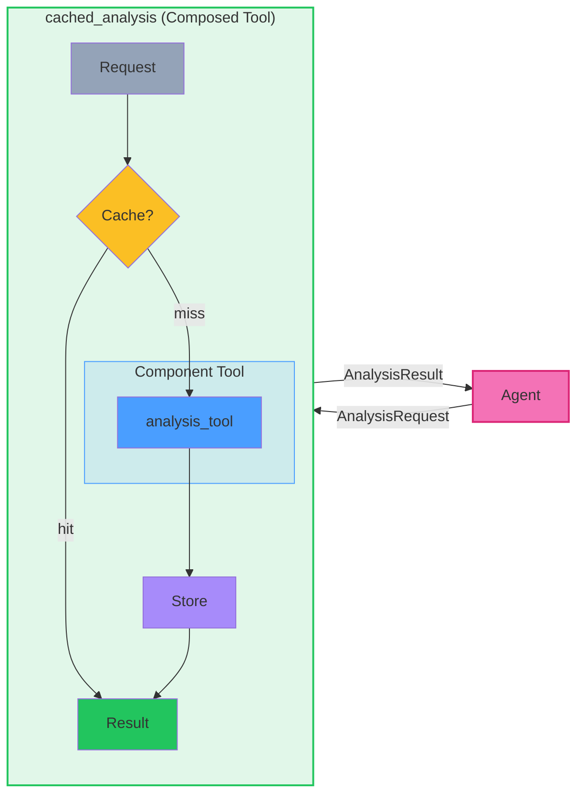
```mermaid
graph LR
    AGENT[Agent] -->|"AnalysisRequest"| COMPOSED
    subgraph COMPOSED["cached_analysis (Composed Tool)"]
        A[Request] --> C{Cache?}
        C -->|hit| R[Result]
        C -->|miss| B[analysis_tool]
        B --> S[Store]
        S --> R
        
        subgraph COMPONENT["Component Tool"]
            B
        end
    end
    COMPOSED -->|"AnalysisResult"| AGENT
    
    style AGENT fill:#f472b6,stroke:#db2777,stroke-width:2px
    style A fill:#94a3b8
    style C fill:#fbbf24
    style B fill:#4a9eff
    style S fill:#a78bfa
    style R fill:#22c55e
    style COMPONENT fill:#4a9eff22,stroke:#4a9eff
    style COMPOSED fill:#22c55e22,stroke:#22c55e,stroke-width:2px
```

---

### 15. **Claim Check**

*Store large payloads externally, pass reference through pipeline.*

**Camel:**
```java
// Types: Route<A, A> = push<A, Ref> × Route<Ref, Ref> × pop<Ref, A>
// claimCheck: A -> (A -> Ref) × (Ref -> B) × (Ref -> A) -> B  (stash/unstash)
from("direct:start")                          // Route<Void, LargePayload>
    .claimCheck(ClaimCheckOperation.Push)     // LargePayload -> Ref; store in ClaimCheckRepo
    .to("direct:lightweightProcess")          // Endpoint<Ref, Ref> (works with ref only)
    .claimCheck(ClaimCheckOperation.Pop);     // Ref -> LargePayload; retrieve from repo
// Push: body -> repo[key], exchange.body = key
// Pop:  key -> repo[key], exchange.body = original
// Result: Route<Void, LargePayload>
```

**MCP Algebra:**
```
// Component tools
blob_storage.put:               (doc: LargeDocument) -> BlobRef
blob_storage.get:               (ref: BlobRef) -> LargeDocument
lightweight_metadata_extraction: (ref: BlobRef) -> Metadata
routing_decision:               (metadata: Metadata) -> RoutingInfo
full_processing:                (doc: LargeDocument) -> ProcessedDocument

// Composed tool
large_doc_processor: (doc: LargeFile) -> ProcessedDocument

claim_check(
    large_document,
    store: blob_storage.put,
    pipeline: [
        lightweight_metadata_extraction,  // works with reference
        routing_decision,
        full_processing                   // retrieves full document
    ],
    retrieve: blob_storage.get
)
```

**Example:** Store large PDF in blob storage, pass reference through routing logic, retrieve for final processing.

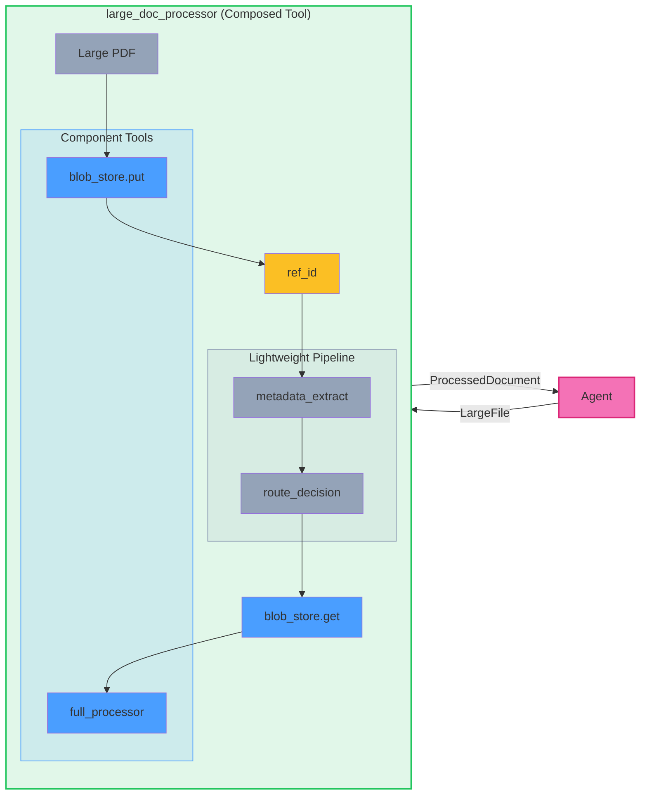
```mermaid
graph LR
    AGENT[Agent] -->|"LargeFile"| COMPOSED
    subgraph COMPOSED["large_doc_processor (Composed Tool)"]
        A[Large PDF] --> S[blob_store.put]
        S --> R[ref_id]
        subgraph LIGHTWEIGHT["Lightweight Pipeline"]
            P1[metadata_extract]
            P2[route_decision]
        end
        R --> P1 --> P2
        P2 --> G[blob_store.get]
        G --> F[full_processor]
        
        subgraph COMPONENTS["Component Tools"]
            S
            F
        end
    end
    COMPOSED -->|"ProcessedDocument"| AGENT
    
    style AGENT fill:#f472b6,stroke:#db2777,stroke-width:2px
    style A fill:#94a3b8
    style S fill:#4a9eff
    style R fill:#fbbf24
    style P1 fill:#94a3b8
    style P2 fill:#94a3b8
    style G fill:#4a9eff
    style F fill:#4a9eff
    style LIGHTWEIGHT fill:#94a3b822,stroke:#94a3b8
    style COMPONENTS fill:#4a9eff22,stroke:#4a9eff
    style COMPOSED fill:#22c55e22,stroke:#22c55e,stroke-width:2px
```

---

### 16. **Transactional Outbox / Saga**

*Coordinate multi-tool operations with compensation on failure.*

**Camel (Saga):**
```java
// Types: Route<A, B | Compensated> = saga × [(action, compensate)]
// saga: List<(A -> B, B -> Void)> -> (A -> B | Compensated)  (all-or-nothing)
saga()                                        // SagaDefinition<A, B>
    .propagation(SagaPropagation.REQUIRED)    // SagaPropagation: REQUIRED | REQUIRES_NEW | ...
    .compensation("direct:compensate")        // Endpoint<Context, Void> (rollback handler)
    .to("direct:step1")                       // Endpoint<A, Intermediate> + implicit compensate
    .to("direct:step2");                      // Endpoint<Intermediate, B>
// On step2 failure: call compensations in reverse order
// Result: Route<A, B | Compensated>
```

**MCP Algebra:**
```
// Action tools
database.insert:       (record: Record) -> InsertResult
email.send:            (notification: Email) -> SendResult
external_api.register: (data: RegistrationData) -> RegisterResult

// Compensation tools
database.delete:         (id: RecordId) -> void
email.send_cancellation: (notification: Email) -> void
external_api.unregister: (id: RegistrationId) -> void

// Composed tool
transactional_registration: (data: RegistrationData) -> Success | RolledBack

saga(
    steps: [
        { action: database.insert(record), compensate: database.delete(record.id) },
        { action: email.send(notification), compensate: email.send(cancellation) },
        { action: external_api.register, compensate: external_api.unregister }
    ],
    on_failure: rollback_all
)
```

**Example:** Multi-step workflow where each MCP tool call has a compensating action if later steps fail.

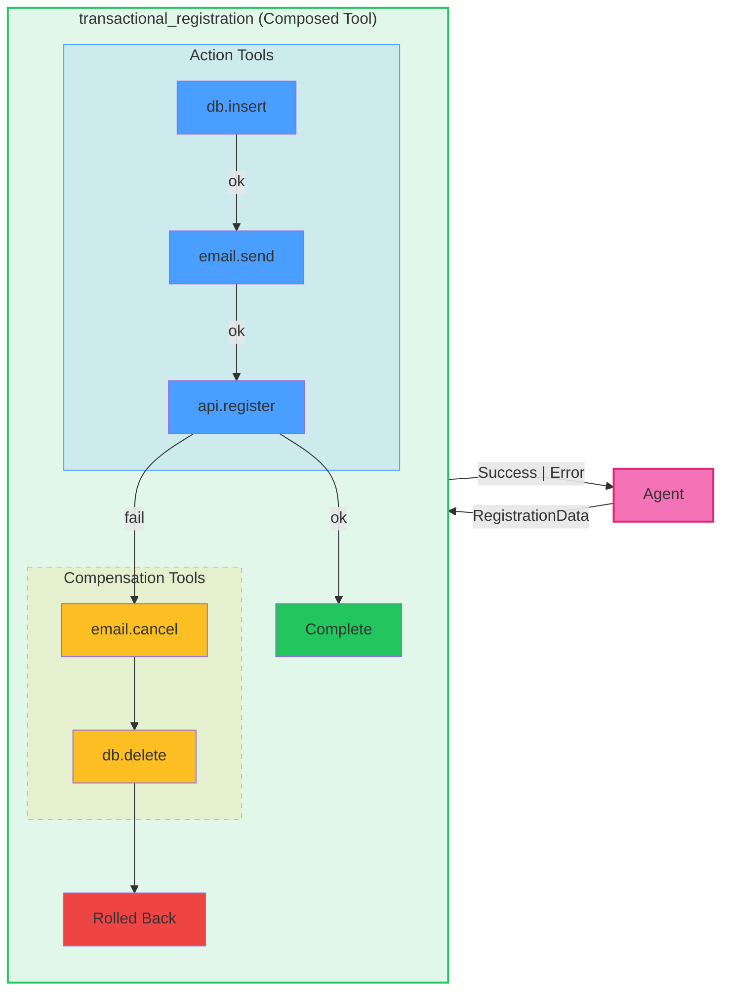
```mermaid
graph LR
    AGENT[Agent] -->|"RegistrationData"| COMPOSED
    subgraph COMPOSED["transactional_registration (Composed Tool)"]
        subgraph ACTIONS["Action Tools"]
            A[db.insert]
            B[email.send]
            C[api.register]
        end
        subgraph COMPENSATE["Compensation Tools"]
            A2[db.delete]
            B2[email.cancel]
        end
        A -->|ok| B -->|ok| C
        C -->|fail| B2 --> A2
        C -->|ok| D[Complete]
        A2 --> FAIL[Rolled Back]
    end
    COMPOSED -->|"Success | Error"| AGENT
    
    style AGENT fill:#f472b6,stroke:#db2777,stroke-width:2px
    style A fill:#4a9eff
    style B fill:#4a9eff
    style C fill:#4a9eff
    style A2 fill:#fbbf24
    style B2 fill:#fbbf24
    style D fill:#22c55e
    style FAIL fill:#ef4444
    style ACTIONS fill:#4a9eff22,stroke:#4a9eff
    style COMPENSATE fill:#fbbf2422,stroke:#fbbf24,stroke-dasharray: 5 5
    style COMPOSED fill:#22c55e22,stroke:#22c55e,stroke-width:2px
```

---

## Compositional Algebra: The DSL

Here's what a declarative DSL might look like:

```
// Component tool type signatures
web_search:         (query: string) -> SearchResult[]
arxiv_search:       (query: string) -> SearchResult[]
internal_docs:      (query: string) -> SearchResult[]
citation_tool.get:  (doc_id: DocId) -> Citation[]
summarize_tool.run: (content: string) -> Summary
audit_log:          (event: AuditEvent) -> void

// Schema types
type ResearchDocument = {
    id: DocId,
    title: string,
    content: string,
    relevance_score: float,
    source: string
}

type EnrichedDocument = ResearchDocument & {
    citations: Citation[],
    summary: Summary
}

type Report = {
    topic: string,
    documents: EnrichedDocument[],
    synthesis: string
}

// Composed workflow tool
ResearchPipeline: (topic: string) -> Report

workflow ResearchPipeline(topic: string) {
    
    // Scatter-gather from multiple sources
    sources = scatter_gather(
        targets: [web_search, arxiv_search, internal_docs],
        query: topic,
        timeout: 10s
    )
    
    // Normalize to common schema  
    normalized = normalize(sources, to: ResearchDocument)
    
    // Filter and enrich
    relevant = normalized
        | filter(doc -> doc.relevance_score > 0.7)
        | enrich(doc -> {
            ...doc,
            citations: citation_tool.get(doc.id),
            summary: summarize_tool.run(doc.content)
        })
    
    // Aggregate final report
    report = aggregate(relevant, strategy: synthesize_report)
    
    // Wire tap for audit
    wiretap(report, to: audit_log)
    
    return report
}
```

---

## Unique MCP Algebra Operations (Beyond Camel)

These patterns are specific to the AI/LLM tool context:

### **Tool Adapter (1:1 Transform)**
The most fundamental composition: wrap a single tool to change its identity or shape without reimplementing its functionality.

```
// Primitive tool (from upstream MCP server)
salesforce.query_contacts: (soql: string) -> SalesforceContact[]
// SalesforceContact = { Id, FirstName, LastName, Email, AccountId, ... 50 more fields }

// Adapted tool (curated for your agent's context)
get_customer_emails: (company_name: string) -> CustomerEmail[]

adapt(
    tool: salesforce.query_contacts,
    
    // Rename for agent clarity
    name: "get_customer_emails",
    description: "Get email addresses for customers at a company. Returns only name and email.",
    
    // Transform input: agent-friendly -> tool-native
    input_transform: (company_name) -> {
        soql: `SELECT FirstName, LastName, Email FROM Contact WHERE Account.Name = '${company_name}'`
    },
    
    // Transform output: tool-native -> context-optimized
    output_transform: (contacts) -> contacts.map(c => ({
        name: `${c.FirstName} ${c.LastName}`,
        email: c.Email
    }))
)
```

**Why this matters for agents:**

| Aspect | Before (raw tool) | After (adapted tool) |
|--------|-------------------|---------------------|
| **Name** | `salesforce.query_contacts` (cryptic) | `get_customer_emails` (intent-clear) |
| **Description** | Generic SOQL query interface | Task-specific, guides LLM selection |
| **Input** | Raw SOQL string (agent must generate) | Simple `company_name` parameter |
| **Output** | 50+ fields per contact (token bloat) | 2 fields (name, email) |
| **Context cost** | ~500 tokens per result | ~30 tokens per result |

**Example: Curating a Verbose API**

A GitHub MCP server returns full repository objects with 80+ fields. Your coding agent only needs name, description, and clone URL:

```
// Primitive tool
github.search_repos: (query: string) -> GitHubRepository[]  // 80+ fields each

// Adapted tool  
find_repos: (topic: string) -> RepoSummary[]

adapt(
    tool: github.search_repos,
    name: "find_repos",
    description: "Find repositories by topic. Returns name, description, and clone URL only.",
    input_transform: (topic) -> { query: `topic:${topic} stars:>100` },
    output_transform: (repos) -> repos.slice(0, 10).map(r => ({
        name: r.full_name,
        description: r.description?.slice(0, 100),
        clone_url: r.clone_url
    }))
)
```

The agent developer gains full control over what enters the LLM context—without forking the GitHub MCP server or reimplementing its OAuth flow, pagination, and rate limiting.

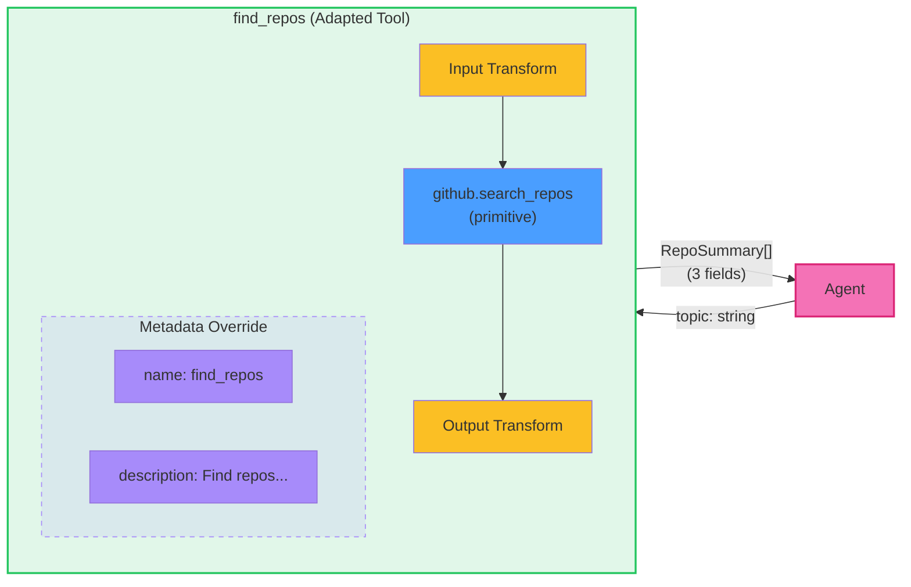
```mermaid
graph LR
    AGENT[Agent] -->|"topic: string"| COMPOSED
    subgraph COMPOSED["find_repos (Adapted Tool)"]
        I[Input Transform] --> P["github.search_repos<br/>(primitive)"]
        P --> O[Output Transform]
        
        subgraph META["Metadata Override"]
            N["name: find_repos"]
            D["description: Find repos..."]
        end
    end
    COMPOSED -->|"RepoSummary[]<br/>(3 fields)"| AGENT
    
    style AGENT fill:#f472b6,stroke:#db2777,stroke-width:2px
    style I fill:#fbbf24
    style P fill:#4a9eff
    style O fill:#fbbf24
    style N fill:#a78bfa
    style D fill:#a78bfa
    style META fill:#a78bfa22,stroke:#a78bfa,stroke-dasharray: 5 5
    style COMPOSED fill:#22c55e22,stroke:#22c55e,stroke-width:2px
```

---

### **Schema Mediator**
Automatically transform between incompatible tool schemas using LLM understanding:

```
// Component tools (incompatible schemas)
tool_a: (input: InputA) -> OutputA    // OutputA = {x: X, y: Y, z: Z}
tool_b: (input: InputB) -> OutputB    // InputB  = {a: A, b: B, c: C}

// Schema transformation
llm_transform:     (data: OutputA, target: Schema<InputB>) -> InputB
explicit_mapping:  (data: OutputA) -> InputB

// Composed tool
tool_a_to_b: (input: InputA) -> OutputB

schema_mediate(
    from: tool_a.output_schema,
    to: tool_b.input_schema,
    strategy: llm_transform | explicit_mapping
)
```

**Example: CRM-to-Marketing Pipeline**

A sales team uses HubSpot for CRM while marketing uses Mailchimp for campaigns. When a deal closes, you want to automatically add the customer to a nurture campaign—but the schemas are completely different:

```
// HubSpot outputs deal data in its format
hubspot.get_deal: (deal_id: string) -> HubSpotDeal
// HubSpotDeal = {
//   properties: { dealname, amount, closedate, dealstage },
//   associations: { contacts: [{ email, firstname, lastname, company }] }
// }

// Mailchimp expects subscriber data in its format  
mailchimp.add_subscriber: (subscriber: MailchimpSubscriber) -> SubscribeResult
// MailchimpSubscriber = {
//   email_address: string,
//   merge_fields: { FNAME, LNAME, COMPANY, DEAL_VALUE },
//   tags: string[]
// }

// Composed tool: closes the gap automatically
deal_to_nurture: (deal_id: string) -> SubscribeResult

pipeline(
    hubspot.get_deal(deal_id),
    schema_mediate(
        strategy: llm_transform,  // LLM understands semantic mapping
        hints: {
            "associations.contacts[0].email" -> "email_address",
            "properties.amount" -> "merge_fields.DEAL_VALUE"
        }
    ),
    mailchimp.add_subscriber
)
```

The LLM-powered mediator understands that `firstname` maps to `FNAME`, that `amount` should become `DEAL_VALUE`, and can even infer appropriate `tags` like `["new-customer", "enterprise"]` based on deal properties—without explicit field-by-field mapping.

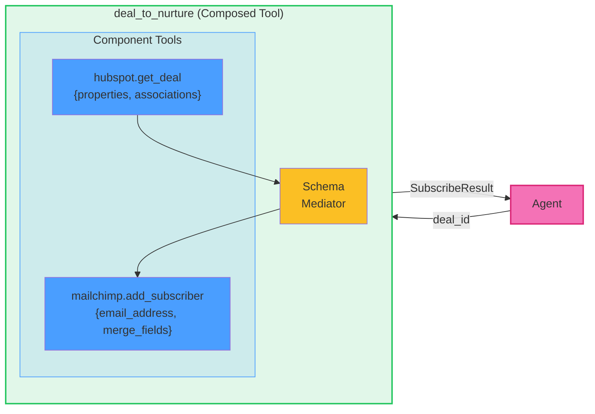
```mermaid
graph LR
    AGENT[Agent] -->|"deal_id"| COMPOSED
    subgraph COMPOSED["deal_to_nurture (Composed Tool)"]
        subgraph COMPONENTS["Component Tools"]
            A["hubspot.get_deal<br/>{properties, associations}"]
            B["mailchimp.add_subscriber<br/>{email_address, merge_fields}"]
        end
        A --> M[Schema<br/>Mediator]
        M --> B
    end
    COMPOSED -->|"SubscribeResult"| AGENT
    
    style AGENT fill:#f472b6,stroke:#db2777,stroke-width:2px
    style A fill:#4a9eff
    style M fill:#fbbf24
    style B fill:#4a9eff
    style COMPONENTS fill:#4a9eff22,stroke:#4a9eff
    style COMPOSED fill:#22c55e22,stroke:#22c55e,stroke-width:2px
```

### **Capability Router**
Route based on what tools can do, not just message content:

```
// Component tools (discovered at runtime)
ocr_tool:     (image: Image) -> Text           // capability: text extraction
vision_tool:  (image: Image) -> Table[]        // capability: table extraction
pdf_tool:     (pdf: PDF) -> Text               // capability: pdf parsing

// Discovery and selection
discover_mcp_servers: () -> ToolDescriptor[]
best_capability_match: (need: string, tools: ToolDescriptor[]) -> Tool

// Composed tool
smart_table_extractor: (image: Image) -> Table[]

capability_route(
    need: "extract tables from image",
    available_tools: discover_mcp_servers(),
    select: best_capability_match
)
```

**Example: Universal Code Execution**

An AI assistant needs to execute code snippets, but different users have different MCP servers available—some have a local Python sandbox, others have a cloud Jupyter environment, and enterprise users have access to a secure execution environment. The capability router dynamically selects the best available option:

```
// Available execution tools vary by user's environment
local_python:      (code: string) -> ExecutionResult  // capability: python, local, fast
jupyter_cloud:     (code: string) -> ExecutionResult  // capability: python, r, julia, persistent
enterprise_sandbox: (code: string) -> ExecutionResult // capability: python, audited, isolated
browser_pyodide:   (code: string) -> ExecutionResult  // capability: python, limited, no-network

// Composed tool adapts to available capabilities
execute_code: (code: string, requirements: ExecutionRequirements) -> ExecutionResult

capability_route(
    need: requirements.describe(),  
    // e.g., "execute Python with numpy, needs network access"
    available_tools: discover_mcp_servers(),
    select: best_capability_match,
    fallback: browser_pyodide  // always available as last resort
)
```

When the agent needs to run `import pandas; df = pd.read_csv("https://...")`, the capability router:
1. Discovers available execution environments
2. Matches requirements (Python + network access + pandas)
3. Routes to `jupyter_cloud` (has network) over `browser_pyodide` (no network)
4. Falls back gracefully if the best option is unavailable

```mermaid
graph LR
    AGENT[Agent] -->|"code + requirements"| COMPOSED
    subgraph COMPOSED["execute_code (Composed Tool)"]
        N["Need: python + network + pandas"] --> D{Capability<br/>Match}
        subgraph POOL["Available Component Tools"]
            T1["local_python (no pandas)"]
            T2["jupyter_cloud (full)"]
            T3["browser_pyodide (no network)"]
        end
        D -.-> T1
        D --> T2
        D -.-> T3
        T2 --> R[Result]
    end
    COMPOSED -->|"ExecutionResult"| AGENT
    
    style AGENT fill:#f472b6,stroke:#db2777,stroke-width:2px
    style N fill:#94a3b8
    style D fill:#fbbf24
    style T1 fill:#94a3b8,stroke-dasharray: 5 5
    style T2 fill:#4a9eff
    style T3 fill:#94a3b8,stroke-dasharray: 5 5
    style R fill:#22c55e
    style POOL fill:#4a9eff22,stroke:#4a9eff
    style COMPOSED fill:#22c55e22,stroke:#22c55e,stroke-width:2px
```

### **Semantic Deduplicator**
Deduplicate results based on semantic similarity, not exact match:

```
// Component tools
search_a: (query: string) -> SearchResult[]
search_b: (query: string) -> SearchResult[]
search_c: (query: string) -> SearchResult[]
search_d: (query: string) -> SearchResult[]

// Deduplication strategy
keep_highest_quality: (duplicates: SearchResult[]) -> SearchResult

// Composed tool
deduped_multi_search: (query: string) -> UniqueResult[]

semantic_dedup(
    results: multi_source_search_results,
    similarity_threshold: 0.85,
    strategy: keep_highest_quality
)
```

**Example: Research Paper Discovery**

A researcher asks an AI assistant to find papers on "transformer attention mechanisms." The assistant queries multiple academic sources, but the same papers appear across databases with slightly different metadata:

```
// Academic search tools return overlapping results
arxiv_search:          (query: string) -> Paper[]   // "Attention Is All You Need" (preprint)
semantic_scholar:      (query: string) -> Paper[]   // "Attention Is All You Need" (with citations)
google_scholar:        (query: string) -> Paper[]   // "Attention is all you need" (lowercase)
ieee_xplore:           (query: string) -> Paper[]   // "Attention Is All You Need" (published version)

// Composed tool
comprehensive_paper_search: (query: string) -> UniquePaper[]

scatter_gather(
    query: "transformer attention mechanisms",
    targets: [arxiv_search, semantic_scholar, google_scholar, ieee_xplore]
) | semantic_dedup(
    similarity_threshold: 0.90,
    strategy: keep_richest_metadata,
    // Embedding-based comparison catches:
    // - Same paper, different title casing
    // - Preprint vs. published version  
    // - Papers with/without subtitles
    // - Translated titles
    merge_metadata: true  // Combine citation counts, venues, etc.
)
```

Without semantic dedup, the researcher gets 4 copies of the seminal Vaswani paper. With it, they get one comprehensive entry that combines:
- Citation count from Semantic Scholar (100k+)
- PDF link from arXiv
- DOI from IEEE
- Publication venue from Google Scholar

The 0.90 threshold ensures near-duplicates merge while genuinely different papers on attention (e.g., "Longformer: The Long-Document Transformer") remain separate.

```mermaid
graph LR
    AGENT[Agent] -->|"query: transformers"| COMPOSED
    subgraph COMPOSED["comprehensive_paper_search (Composed Tool)"]
        subgraph SOURCES["Source Tools"]
            A["arxiv: Attention Is All..."]
            B["semantic_scholar: Attention Is All..."]
            C["google_scholar: attention is all..."]
            E["ieee: Attention Is All... (DOI)"]
        end
        A --> D{Semantic<br/>Dedup 0.90}
        B --> D
        C --> D
        E --> D
        D --> R1["Vaswani et al. (merged, enriched)"]
        D --> R2["Longformer (unique)"]
        D --> R3["BERT (unique)"]
    end
    COMPOSED -->|"UniquePaper[]"| AGENT
    
    style AGENT fill:#f472b6,stroke:#db2777,stroke-width:2px
    style A fill:#4a9eff
    style B fill:#94a3b8,stroke-dasharray: 5 5
    style C fill:#94a3b8,stroke-dasharray: 5 5
    style E fill:#94a3b8,stroke-dasharray: 5 5
    style D fill:#fbbf24
    style R1 fill:#22c55e
    style R2 fill:#22c55e
    style R3 fill:#22c55e
    style SOURCES fill:#4a9eff22,stroke:#4a9eff
    style COMPOSED fill:#22c55e22,stroke:#22c55e,stroke-width:2px
```

### **Confidence Aggregator**
Aggregate results weighted by tool reliability/confidence:

```
// Component tools (with confidence weights)
authoritative_source: (query: string) -> Answer   // weight: 0.9
web_search:           (query: string) -> Answer   // weight: 0.6
cached_results:       (query: string) -> Answer   // weight: 0.3

// Aggregation strategy
weighted_consensus: (answers: WeightedAnswer[]) -> ConsensusAnswer

// Composed tool
weighted_answer: (question: string) -> WeightedAnswer

confidence_aggregate(
    sources: [
        { tool: authoritative_source, weight: 0.9 },
        { tool: web_search, weight: 0.6 },
        { tool: cached_results, weight: 0.3 }
    ],
    strategy: weighted_consensus
)
```

**Example: Medical Information Verification**

A healthcare AI assistant needs to answer patient questions about drug interactions. Different sources have vastly different reliability, and the system must weigh them appropriately:

```
// Component tools with explicit reliability weights
fda_drug_database:     (drug_pair: DrugPair) -> InteractionInfo  // weight: 0.95, authoritative
pubmed_search:         (drug_pair: DrugPair) -> StudyResults[]   // weight: 0.80, peer-reviewed
drugs_com:             (drug_pair: DrugPair) -> InteractionInfo  // weight: 0.70, curated
web_search:            (query: string) -> SearchResult[]         // weight: 0.30, unverified
llm_medical_knowledge: (query: string) -> Answer                 // weight: 0.20, may hallucinate

// Composed tool
drug_interaction_check: (drug_a: string, drug_b: string) -> SafetyAssessment

confidence_aggregate(
    query: { drug_a: "warfarin", drug_b: "aspirin" },
    sources: [
        { tool: fda_drug_database,     weight: 0.95 },
        { tool: pubmed_search,         weight: 0.80 },
        { tool: drugs_com,             weight: 0.70 },
        { tool: web_search,            weight: 0.30 },
        { tool: llm_medical_knowledge, weight: 0.20 }
    ],
    strategy: weighted_consensus_with_conflict_detection,
    conflict_threshold: 0.5,  // Flag if high-weight sources disagree
    require_authoritative: true  // Must have FDA or PubMed confirmation
)
```

For "warfarin + aspirin":
- **FDA (0.95)**: "Major interaction - increased bleeding risk"
- **PubMed (0.80)**: Multiple studies confirming bleeding risk
- **Drugs.com (0.70)**: "Serious interaction"
- **Web search (0.30)**: Mixed results, some forums say "it's fine"
- **LLM (0.20)**: "Generally should be avoided"

The aggregator:
1. Computes weighted consensus: Strong "dangerous" signal (0.95 + 0.80 + 0.70 >> 0.30)
2. Detects no conflict among authoritative sources
3. Returns high-confidence warning with citations to FDA and PubMed
4. Discounts the forum posts that contradict authoritative sources

```mermaid
graph LR
    AGENT[Agent] -->|"drug_a, drug_b"| COMPOSED
    subgraph COMPOSED["drug_interaction_check (Composed Tool)"]
        subgraph SOURCES["Component Tools (weighted)"]
            A["FDA Database (0.95)"]
            B["PubMed (0.80)"]
            C["Drugs.com (0.70)"]
            D["Web Search (0.30)"]
            E["LLM Knowledge (0.20)"]
        end
        A --> W[Confidence<br/>Aggregator]
        B --> W
        C --> W
        D --> W
        E --> W
        W --> R["SafetyAssessment<br/>(high confidence)"]
    end
    COMPOSED -->|"SafetyAssessment"| AGENT
    
    style AGENT fill:#f472b6,stroke:#db2777,stroke-width:2px
    style A fill:#22c55e
    style B fill:#22c55e
    style C fill:#4a9eff
    style D fill:#94a3b8
    style E fill:#94a3b8
    style W fill:#a78bfa
    style R fill:#22c55e
    style SOURCES fill:#4a9eff22,stroke:#4a9eff
    style COMPOSED fill:#22c55e22,stroke:#22c55e,stroke-width:2px
```

---

## Summary: The Algebra

| Primitive | Type Signature (conceptual) | Description | Example |
|-----------|----------------------------|-------------|---------|
| `adapt` | `Tool × Transforms -> Tool` | 1:1 transform: rename, redescribe, reshape input/output | Wrap verbose Salesforce API → curated `get_customer_emails` |
| `pipeline` | `[Tool] -> Tool` | Chain tools sequentially; each output feeds the next input | `search -> fetch -> summarize -> store` |
| `parallel` | `[Tool] -> Tool` | Execute multiple tools concurrently | `[translate_en, translate_fr, translate_de]` |
| `route` | `(Input -> ToolSelector) -> Tool` | Dispatch to different tools based on input content | Route by file type: PDF->pdf_tool, XLSX->xlsx_tool |
| `scatter_gather` | `[Tool] × Aggregator -> Tool` | Query multiple tools in parallel, aggregate responses | Query 3 knowledge bases, return best combined answer |
| `split` | `Splitter × Tool -> Tool` | Split collection, process each item independently | Process each file in a directory through analysis pipeline |
| `aggregate` | `[Result] × Strategy -> Result` | Collect results from multiple operations and combine | Multi-source search with merge and deduplicate |
| `filter` | `Predicate × Tool -> Tool` | Conditionally pass or block messages | Keep only results from last 7 days + trusted sources |
| `enrich` | `Tool × [Enricher] -> Tool` | Augment data by calling additional tools | Add CRM history, web presence, sentiment to customer record |
| `normalize` | `Tool × Schema -> Tool` | Convert heterogeneous outputs to common schema | Unify Google Drive, Slack, Confluence results to `{title, content, url}` |
| `wiretap` | `Tool × Observer -> Tool` | Copy data to side channel without affecting main flow | Log all tool invocations for audit/debugging |
| `circuit_breaker` | `Tool × Fallback × Config -> Tool` | Protect against cascading failures from unreliable tools | After 5 failures, trip circuit and use local cache |
| `retry` | `Tool × Policy -> Tool` | Automatically retry failed tool invocations | Retry 3× with exponential backoff, then fallback |
| `throttle` | `Tool × Rate -> Tool` | Control rate of tool invocations | Limit API calls to 100/minute with token bucket |
| `cache` | `Tool × KeyFn × TTL -> Tool` | Prevent duplicate processing via memoization | Don't re-analyze same document within 1 hour |
| `schema_mediate` | `Tool × Schema × Strategy -> Tool` | Transform between incompatible schemas (LLM-assisted) | HubSpot deal → Mailchimp subscriber format |
| `capability_route` | `Need × [Tool] -> Tool` | Route based on tool capabilities, not just content | Select execution env matching Python + network + pandas |
| `semantic_dedup` | `[Result] × Threshold -> [Result]` | Deduplicate by semantic similarity, not exact match | Merge same paper from arXiv, Semantic Scholar, IEEE |
| `confidence_aggregate` | `[(Tool, Weight)] × Strategy -> Tool` | Aggregate results weighted by source reliability | Weight FDA (0.95) over web forums (0.30) for drug info |

The key insight is that **tools compose**. Just as Camel lets you build complex integrations from simple, composable routing primitives, an MCP algebra would let you build complex AI workflows from simple, composable tool orchestration primitives—without writing imperative glue code.

Would you like me to sketch out a more formal type system for this algebra, or prototype what an actual implementation might look like?